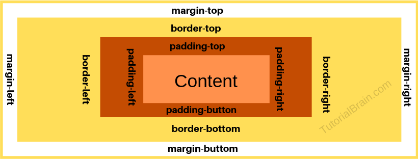
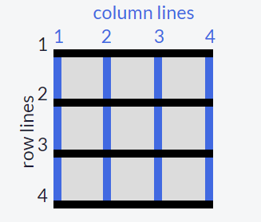
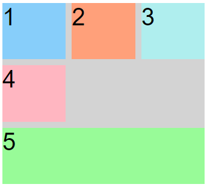
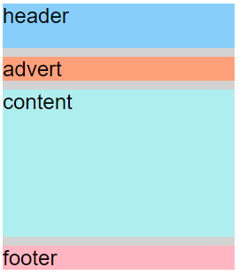
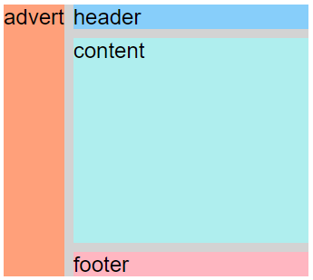
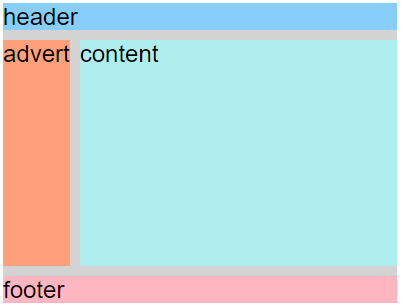

# <u> **CSS** </u>

**Cascading Style Sheets (CSS)** tell the browser how to display the text and other content that you write in HTML. Note that CSS is case-sensitive so be careful with your capitalization. It allows you to control:
- color
- fonts
- positioning
- spacing
- sizing
- decorations
- transitions

They can use in 3 different ways: 
1.	Inline styles directly to HTML elements with the style attribute
2.	Within style tags in an HTML document
3.	Write the CSS rules in an external style sheet, then reference that file in the HTML document. This improves the readability and reusability of your code.

Color change. Ex.: 
```html
<h2 style="color: blue;">CatPhotoApp</h2>
```
|View|
|---|
|<h2 style="color: blue;">CatPhotoApp</h2>|

## **CSS Selectors**
Using a style block (selector) you can apply one format too all elements of the same type. We use opening and closing curly braces and semicolons at the end of each element style rule.
```html
<style>
  h2 {
    color: red;
  }
</style>
```

## **CSS Class**
Also known as class selector. Reusable styles that can be added to multiple elements. Ex.:
```html
<style>
  .blue-text {
    color: blue;
  }
</style>
<h2 class=“blue-text”>CatPhotoApp</h2>
```

## **Font Size**
```html
<style>
h1 {
  font-size: 30px;
}

Font Type. Ex.
h2 {
  font-family: sans-serif;
}
</style>
```
## **Import Fonts**
We can specify non-standard, custom web fonts for use on our website. There are many sources for web fonts on the Internet. Ex.:
```html
<link href="https://fonts.googleapis.com/css?family=Lobster" rel="stylesheet" type="text/css">
```
This imports the font Lobster from the Google Fonts public library using its URL. Its syntax is font-family: FAMILY_NAME, GENERIC_NAME;. Where Lobster will replace FAMILY_NAME and GENERIC_NAME is optional, and is a fallback font in case the other specified font is not available. At GENERIC_NAME you will indicate a font of a generic-family like "serif", "sans-serif", "cursive", "fantasy", "monospace". Ex.:
```css
h2 {
    font-family: Lobster, serif;
  }
```

## **Degrade Fonts**
Let’s expand more on GENERIC_NAME. These are the generic font families we can degrade our text to if the font we want to use cannot be found by the browser. Ex.:
```css
p {
  font-family: Helvetica, sans-serif;
}
```
Generic font family names are not case-sensitive. Also, they do not need quotes because they are CSS keywords.

## **Image size**
We use the property width. And use pixels to indicate the size.
```css
<style>
  .larger-image {
    width: 500px;
  }
</style>
```

## **Border for elements** 
Ex.:
```css
<style>
  .thin-red-border {
    border-color: red;
    border-width: 5px;
    border-style: solid;
  }
</style>
```
If you want the corners to be round you use: `border-radius: 10px;`
Apart from pixels you can use percentage for the radius: border-radius: 50%;

## **Background Color**
Ex.:
.green-background {
  background-color: green;
}
**Note:** All elements have a default background-color of transparent.

## **`id`** 
Each HTML element can also have an `id` attribute. You can use them to select and modify specific elements with JavaScript. Id should be unique.
```html
<h2 id="cat-photo-app">
```

## **Applying style to specific id**
Also known as ID Selector. Inside a style element you can apply a style or set of styles to a specific element using its id.
```css
#cat-photo-element {
  background-color: green;
}
```

If the referenced element has a class applying a style to it, the one given by the id takes priority and will be applied.

## **Padding**
All HTML elements are essentially little rectangles. Three important properties control the space that surrounds each HTML element: padding, margin, and border. Padding controls the amount of space between the element's content and its border.
```css
padding: 20px;
padding: 20px 30px 10px 15px; /*top is 20, right is 30, bottom is 10, left is 15*/
/* For padding on specific side*/
padding-top: 20px;
padding-right: 20px;
padding-bottom: 20px;
padding-left: 20px;
```

## **Margin**
Controls the amount of space between an element’s border and surrounding elements.
```css
margin: 20px; <!--applies to all 4 margins-->
margin: 20px 30px; <!-- 20 for the top and bottom margins, 30 for the left and right -->
margin: 20px 30px 10px; <!-- top is 20, right and left are 30 and bottom is 10 -->
margin: 20px 30px 10px 15px; <!-- top is 20, right is 30, bottom is 10, left is 15 -->
<!-- For margin on specific side -->
margin-top: 20px;
margin-right: 20px;
margin-bottom: 20px;
margin-left: 20px;
```

If you add a negative value to a margin the element will grow larger.

## **Attribute selector**
This selector matches and styles elements with a specific attribute value.
```css
[type='radio'] {
  margin: 20px 0px 20px 0px;
}
/*Changes the margins of all elements with the attribute type and a corresponding value of radio*/
 ```


## **Relative Lengths**
Relative length units specify a length relative to another length property. Relative length units scale better between different rendering mediums. The most common are:
-	`em`: Relative to the font-size of the element (2em means 2 times the size of the current font)
  ``` css
  p {
    font-size: 16px;
        line-height: 2em; /*This equals 32px*/
  }
  ```
-	`rem`: Relative to font-size of the root element. It does not inherit from its parent element.
```css
{
  font-size:16px;
}

div {
  font-size: 3rem; /*This equals 48px*/
  border: 1px solid black;
}
```

-	`vw`: Relative to 1% of the width of the viewport*	
```html
<style>
h1 {
  font-size: 20vw; /*20% of the size of the browser window*/
}
</style>

<h1>Hello</h1> <!-- Changing the width of the browser changes the size of Hello. On vh the same will happen resizing the height.-->
```
-	`vh`: Relative to 1% of the height of the viewport*.	
-	`vmin`: Relative to 1% of viewport's* smaller dimension	. If width is smaller, then a percentage of the width size, if height is smaller, then a percentage of the height size.
-	`vmax`: Relative to 1% of viewport's* larger dimension. If width is larger, then a percentage of the width size, if height is larger, then a percentage of the height size.	
-`	%:` Relative to the parent element
```html
<style>
body {
 font-size:16px; /*The font-size of this document is 16px.*/
}
div {
  font-size: 150%;
}
</style>

<body>
<div>The font-size of this div element is 150%.</div> <!--The % unit sets the font-size relative to the current font-size-->
</body>
```

* Viewport = the browser window size. If the viewport is 50cm wide, 1vw = 0.5cm.

## **Body** 
All HTML have a body element.
```html
body {
  background-color: black;
}
<!-- This will make the background of the whole page -->
```

Styles applied by classes override the style applied to the body element. You can override the style given by a class using another class. The order of the class declarations in the `<style>` section is what is important. The second declaration will always take precedence over the first. Ex.:
```html
<style>
  body {
    background-color: black;
    font-family: monospace;
    color: green;
  }
  .pink-text {
    color: pink;
  }

  .blue-text {
    color: blue;
  }
  #orange-text {
    color: orange;
  }

</style>
<!-- pink-text and blue-text override body. -->
<h1 class="pink-text blue-text">Hello World!</h1>
<!-- blue-text override pink-text. -->
```

ID Attributes supersede all of the previous styles. Replacing the h1 element line for the next one will make the text orange:
```html
<h1 id="orange-text" class="pink-text blue-text">Hello World!</h1>
<!-- --------- -->
<h1 id="orange-text" class="pink-text blue-text" style="color: white;">Hello World!</h1>
<!-- Inline style override blue-text. -->
```
In many situations, you will use CSS libraries. These may accidentally override your own CSS. So when you absolutely need to be sure that an element has specific CSS, you can use !important.
```css
.pink-text {
    color: pink;
  }
/*Adding !important to the class on the previous code will make the h1 pink*/
```

## **Colors**

**Hex**. We can use 6 hexadecimal digits to represent colors, two each for the red (R), green (G), and blue (B) components. For example, #000000. The code can be shorten: #FF0000 can be #F00. This reduces the total number of possible colors to around 4,000. But browsers will interpret #FF0000 and #F00 as exactly the same color.

**RGB**. Instead of using six hexadecimal digits like you do with hex code, with RGB you specify the brightness of each color with a number between 0 and 255. 
body {
    background-color: rgb(255,165,0);
  }

## **Variables**
Variables in CSS are a way to change many CSS style properties at once by changing only one value. To create one you just need to give it a name with two hyphens in front of it and assign it a value like this:
```css
--penguin-skin: gray;
```
You can assign its value to other CSS properties by referencing the name you gave it:
```css
background: var(--penguin-skin);
```
You can attach a fallback value that your browser will revert to if the given variable is invalid.
**Note:** This fallback is not used to increase browser compatibility, and it will not work on IE browsers. Rather, it is used so that the browser has a color to display if it cannot find your variable.
```css
background: var(--penguin-skin, black);
```

## **Improve compatibility**
When working with CSS you will likely run into browser compatibility issues at some point. This is why it's important to provide browser fallbacks to avoid potential problems. This means that if you do want to provide a browser fallback, it's as easy as providing another more widely supported value immediately before your declaration. That way an older browser will have something to fall back on, while a newer browser will just interpret whatever declaration comes later in the cascade.
```html
<style>
  :root {
    --red-color: red;
  }
  .red-box {
    background: red;  /*like this declaration right here*/
    background: var(--red-color);
    height: 200px;
    width:200px;
  }
</style>
<div class="red-box"></div>
```

## **Inherit CSS Variables**
When you create a variable, it is available for you to use inside the selector in which you create it. It also is available in any of that selector's descendants. This happens because CSS variables are inherited, just like ordinary properties.
To make use of inheritance, CSS variables are often defined in the :root element.
:root is a pseudo-class selector that matches the root element of the document, usually the html element. By creating your variables in :root, they will be available globally and can be accessed from any other selector in the style sheet.
```html
<style>
  :root {
    --penguin-belly: pink;
  }
</style>
```

When you create your variables in `:root` they will set the value of that variable for the whole page. You can then over-write these variables by setting them again within a specific element.
```html
<style>
  :root {
    --penguin-belly: pink;
  }
  .penguin {
    --penguin-belly: white;
    /* Value of the variable changed for the penguin calls */
  }
</style>
```

## **Media Query Syntax**
A media query consists of a media type and can contain one or more expressions, which resolve to either true or false. When true the style inside the brackets is applied.
```css
@media not|only mediatype and (expressions) {
  CSS-Code;
}
```
For example: Here the value of the variables penguin-size and penguin-skin are modified if the screen width in which we are viewing the page is 350px or less.
```html
<style>
  :root {
    --penguin-size: 300px;
    --penguin-skin: gray;
    --penguin-belly: white;
    --penguin-beak: orange;
  }

  @media (max-width: 350px) {
    :root {
      --penguin-size: 200px;
      --penguin-skin: black;
    }
  }
</style>
```
 
---
## <u>**Applied Visual Design**</u>

## **Text-align**
```css
text-align: justify; 
text-align: center;
text-align: right; 
text-align: left;
```

## **Width**
You can specify the width of an element using the width property 
```css
img {
  width: 220px;
}
```

## **Height**
You can specify the height of an element using the height.
```css
img {
  height: 20px;
}
```

## **`strong`** 
The browser applies the CSS of `font-weight: bold;` to the element. This is often used to draw attention to text and symbolize that it is important.
```css
<strong>Stanford University</strong>
```

## **`u`**
Underlines a text. This is often used to signify that a section of text is important, or something to remember. The browser applies the CSS of text-decoration: underline; to the element.
**Note**: Try to avoid using u tag when it could confused with a link.
```css
<u>Ph.D. students</u>
```

## **`em`**
Emphasizes text. This displays text as italicized, as the browser applies the CSS of `font-style: italic;`

## **`s`**
Strikes through text. The browser applies the CSS of `text-decoration:` line-through; to the element. It shows that a section of text is no longer valid.
```css
<h4><s>Google</s></h4>
```

## **`hr`**
Adds a horizontal line across the width of its containing element. This can be used to define a change in topic or to visually separate groups of content. This is a self-closing tag.

## **Background-color Property of Text**
Instead of adjusting your overall background or the color of the text to make the foreground easily readable, you can add a background-color to the element holding the text you want to emphasize. This challenge uses `rgba()` instead of hex codes or normal `rgb()`.
rgba stands for:

  - r = red
  - g = green
  - b = blue
  - a = alpha/level of opacity

The RGB values can range from 0 to 255. The alpha value can range from 1, which is fully opaque or a solid color, to 0, which is fully transparent or clear. `rgba()` is great to use in this case, as it allows you to adjust the opacity. This means you don't have to completely block out the background.
```css
background-color: rgba(45, 45, 45, 0.1);
```

## **`font-size`** 
Adjusts the size of the text in an element.
```css
font-size: 27px;
```

## **`box-shadow`**
**Syntax:** `box-shadow: none|h-offset v-offset blur spread color |inset|initial|inherit;`

Applies one or more shadows to an element. It’s properties are:
- `h-offset` Required. The horizontal offset of the shadow. A positive value puts the shadow on the right side of the box, a negative value puts the shadow on the left side of the box	
- `v-offset` Required. The vertical offset of the shadow. A positive value puts the shadow below the box, a negative value puts the shadow above the box
- `blur` Optional. The blur radius. The higher the number, the more blurred the shadow will be	
- `spread` Optional. The spread radius. A positive value increases the size of the shadow, a negative value decreases the size of the shadow	
- `color` Optional. The color of the shadow. The default value is the text color. Look at CSS Color Values for a complete list of possible color values.
  - **Note:** In Safari (on PC) the color parameter is required. If you do not specify the color, the shadow is not displayed at all.	
- `inset` Optional. Changes the shadow from an outer shadow (outset) to an inner shadow
```css
box-shadow: 0 10px 20px rgba(0,0,0,0.19), 0 6px 6px rgba(0,0,0,0.23);
```

## **opacity**
Adjusts the transparency of an item. The value given will apply to the entire element, whether that's an image with some transparency, or the foreground and background colors for a block of text.
```css
opacity: 0.7;
```
## **`text-transform`**
Changes the appearance of text. It's a convenient way to make sure text on a webpage appears consistently, without having to change the text content of the actual HTML elements. Values:
| Values | Examples |
| ----------- | ----------- |
|lowercase | "transform me"|
|uppercase | "TRANSFORM ME"|
|capitalize | "Transform Me"|
|initial | Use the default value|
|inherit | Use the text-transform|value from the parent element|
|none | Default: Use the original text|
```css
text-transform: uppercase;
```

## **font-weight**
Sets how thick or thin characters are in a section of text.

## **line-height**
sets the amount of vertical space that each line of text gets.

```css
font-weight: 300;
line-height: 25px;
```

## **Pseudo-classes** 
Keywords that can be added to selectors, in order to select a specific state of the element.

## *:hover*
It’s a pseudo-class selector that changes the style of an element when you hover over it. 
```css
a:hover {
  color: red;
}
```

## **`position: relative`**
CSS treats each HTML element as its own box. Block-level items automatically start on a new line (think headings, paragraphs, and divs) while inline items sit within surrounding content (like images or spans). The default layout of elements in this way is called the normal flow of a document, but CSS offers the position property to override it.
When the position of an element is set to `relative`, it allows you to specify how CSS should move it relative to its current position in the normal flow of the page. It pairs with the CSS offset properties of `left` or `right`, and `top` or `bottom`. These say how many pixels, percentages, or ems to move the item away from where it is normally positioned. The following example moves the paragraph 10 pixels away from the bottom:
```css
p {
  position: relative;
  bottom: 10px; /*moves it to the opposite direction*/
}
```

Changing an element's position to relative does not remove it from the normal flow - other elements around it still behave as if that item were in its default position. 
**Note:** Positioning gives you a lot of flexibility and power over the visual layout of a page. It's good to remember that no matter the position of elements, the underlying HTML markup should be organized and make sense when read from top to bottom. This is how users with visual impairments (who rely on assistive devices like screen readers) access your content.

## **`position: absolute`**
Locks the element in place relative to its parent container. Unlike the `relative` position, this removes the element from the normal flow of the document, so surrounding items ignore it.
One nuance with absolute positioning is that it will be locked relative to its closest positioned ancestor. If you forget to add a position rule to the parent item, (this is typically done using `position: relative;`), the browser will keep looking up the chain and ultimately default to the `body` tag.

## **`position: fixed`**
Similar to absolute, removes the element from the normal flow of the document. Other items no longer "realize" where it is positioned. One key difference between the fixed and absolute positions is that an element with a fixed position won't move when the user scrolls.
```css
position: fixed;
```

## **`float`**
Elements are removed from the normal flow of a document and pushed to either the left or right of their containing parent element.
```css
<head>
  <style>
	/*displays the element section ID’d left to the left of the browser*/
    #left {
      float: left; 
      width: 50%;
    }
	/*displays the element aside ID’d right to the right of the browser*/
    #right {
      float: right;
      width: 40%;
    }
    aside, section {
      padding: 2px;
      background-color: #ccc;
    }
  </style>
</head>
<body>
  <header>
    <h1>Welcome!</h1>
  </header>
  <section id="left">
    <h2>Content</h2>
    <p>Good stuff</p>
  </section>
  <aside id="right">
    <h2>Sidebar</h2>
    <p>Links</p>
  </aside>
</body>
```
**Note:** In HTML the aside tag defines some content aside from the content it is placed in. It does not render as anything special in a browser. However, you can use CSS to style the `<aside>` element.
The section tag defines a section in HTML. It meant to indicate you are grouping its children together.

## **`z-index`**
When elements are positioned to overlap (i.e. using `position: absolute | relative | fixed | sticky`), the element coming later in the HTML markup will, by default, appear on the top of the other elements. However, the z-index property can specify the order of how elements are stacked on top of one another. It must be an integer, and higher values for the z-index property of an element move it higher in the stack than those with lower values.
```css
z-index: 1;
```

## **`margin: auto`**
Centers an element horizontally. This method works for images, too. Images are inline elements by default, but can be changed to block elements when you set the display property to block. The block element (like `<p>`) start on a new line, and take up the whole width.

## **hsl**
It’s a CSS property that is an alternative way to pick a color by directly stating these characteristics. It accepts 3 values:
-	**Hue** is what people generally think of as 'color'. In hsl(), hue uses a color wheel concept instead of the spectrum, where the angle of the color on the circle is given as a value between 0 and 360.
-	**Saturation** is the amount of gray in a color. A fully saturated color has no gray in it, and a minimally saturated color is almost completely gray. This is given as a percentage with 100% being fully saturated.
-	**Lightness** is the amount of white or black in a color. A percentage is given ranging from 0% (black) to 100% (white), where 50% is the normal color.
```css
background-color: hsl(180, 100%, 50%); /*cyan*/
```

The `hsl()` option in CSS also makes it easy to adjust the tone of a color. Mixing white with a pure hue creates a tint of that color, and adding black will make a shade. Alternatively, a tone is produced by adding gray or by both tinting and shading. The saturation (‘s’) percent changes the amount of gray and the lightness (‘l’) percent determines how much white or black is in the color. This is useful when you have a base hue you like, but need different variations of it.

## **`linear-gradient`**
Enables you to use color transitions, aka gradients, on elements. It is accessed through the background property:
**Syntax:** 
`background: linear-gradient(gradient_direction, color 1, color 2, color 3, ...);`
```css
background: linear-gradient(35deg, #CCFFFF, #FFCCCC);
```

## **`repeating-linear-gradient`**
Similar to the previous one but it repeats the specified gradient pattern. 
**Syntax:**
`background-image: repeating-linear-gradient(angle | to side-or-corner, color-stop1, color-stop2, ...);`

Values:
- angle. Defines an angle of direction for the gradient. From 0deg to 360deg. Default is 180deg.
- side-or-corner. Defines the position of the starting-point of the gradient line. It consists of two keywords: the first one indicates the horizontal side, left or right, and the second one the vertical side, top or bottom. The order is not relevant and each of the keyword is optional.
- color-stop1, color-stop2,... Color stops are the colors you want to render smooth transitions among. This value consists of a color value, followed by an optional stop position (a percentage between 0% and 100% or a length along the gradient axis).
```css
background: repeating-linear-gradient(90deg, yellow 0px, blue 40px, green 40px, red 80px);
/*the gradient starts with the color yellow at 0 pixels which blends into the second color blue at 40 pixels away from the start. Since the next color stop is also at 40 pixels, the gradient immediately changes to the third color green, which itself blends into the fourth color value red as that is 80 pixels away from the beginning of the gradient.*/

background: repeating-linear-gradient(90deg, yellow 0px, yellow 40px, green 40px, green 80px);
/* If every two color stop values are the same color, the blending isn't noticeable because it's between the same color, followed by a hard transition to the next color, so you end up with stripes.*/
```

## **Background image**
The `background` property supports the `url()` function in order to link to an image of the chosen texture or pattern. The link address is wrapped in quotes inside the parentheses.
```css
background: url("https://cdn-media-1.freecodecamp.org/imgr/MJAkxbh.png")
```

## **Resize element**
Use the transform property with its `scale()` function.
```css
transform: scale(2);
/**/
p:hover {
  transform: scale(2.1);
}
/* When used with pseudo-classes such as :hover that specify a certain state of an element, the transform property can easily add interactivity to your elements.*/
```
**Note:** Applying a `transform` to a `div` element will also affect any child elements contained in the div.

## **skewX()**
Skews or inclines an element along its X (horizontal) axis by a given degree.

## **skewY()**
Skews an element along the Y (vertical) axis.
```css
transform: skewX(24deg);
transform: skewY(24deg);
```
## **`::before`, `after::`** 
Pseudo-elements that are used to add something before or after a selected element. For the `::before` and `::after` pseudo-elements to function properly, they must have a defined content property. This property is usually used to add things like a photo or text to the selected element. When the ::before and `::after` pseudo-elements are used to make shapes, the content property is still required, but it's set to an empty string.
```css
p::after {
  content: "";
}
.heart::before {
  content: "";
}
```

## **`@keyframes` and `animation` Properties**
The animation properties control how the animation should behave and the `@keyframes` rule controls what happens during that animation. 
There are eight animation properties in total:
- `animation-name`. Specifies the name of the `@keyframes` you want to bind to the selector
- `animation-duration`. Specifies how many seconds or milliseconds an animation takes to complete
- `animation-timing-function`. Specifies the speed curve of the animation. If the animation is a car moving from point A to point B in a given time (your `animation-duration`), the `animation-timing-function` says how the car accelerates and decelerates over the course of the drive. Values:
  - `linear`. The animation has the same speed from start to end	
  o	ease. Default value. The animation has a slow start, then fast, before it ends slowly	
  - `ease-in`. The animation has a slow start	
  - `ease-out`. The animation has a slow end	
  - `ease-in-out`. The animation has both a slow start and a slow end
  #div3 {animation-timing-function: ease-in;}
  - `cubic-bezier(n,n,n,n)` **function**.  defines a Cubic Bezier curve which are four points P0, P1, P2, and P3. P0 and P3 are the start and the end of the curve and, in CSS these points are fixed as the coordinates are ratios. P0 is (0, 0) and represents the initial time and the initial state, P3 is (1, 1) and represents the final time and the final state. You set the x and y values for the other two points, and where you place them in the grid dictates the shape of the curve for the animation to follow. This is done in CSS by declaring the x and y values of the p1 and p2 "anchor" points in the form: (x1, y1, x2, y2. The X values must be from 0 to 1.
```css
  animation-timing-function: cubic-bezier(0.25,0.25,0.75,0.75);
animation-timing-function: linear;
/*both do the same*/
```
- `animation-delay`. Specifies a delay before the animation will start
- `animation-iteration-count`. Specifies how many times an animation should be played
```css
animation-iteration-count: 3; /*repeats 3 times*/
animation-iteration-count: infinite; /*never stops repeating*/
```
- `animation-direction`. Specifies whether or not the animation should play in reverse on alternate cycles
- `animation-fill-mode`. Specifies what values are applied by the animation outside the time it is executing
- `animation-play-state`. Specifies whether the animation is running or paused 

`@keyframes` is how to specify exactly what happens within the animation over the duration. The animation is created by gradually changing from one set of CSS styles to another. During the animation, you can change the set of CSS styles many times. Specify when the style change will happen in percent, or with the keywords "from" and "to", which is the same as 0% and 100%. 0% is the beginning of the animation, 100% is when the animation is complete.
Tip: For best browser support, you should always define both the 0% and the 100% selectors.
```css
#anim {
  animation-name: colorful;
  animation-duration: 3s;
}

@keyframes colorful {
  0% {background-color: blue;}
  100% {background-color: yellow;}
}
```
```css
<style>
  img:hover {
    animation-name: width;
    animation-duration: 500ms;
  }

  @keyframes width {
    100% {
      width: 40px;
    }
  }
</style>


/*Changes the width of an image when you hover over it*/
```
<br><br>

___
<br>

# **ACCESSIBILITY**

## **`alt`**
Describes the content of the image and provides a text-alternative for it. This helps in cases where the image fails to load or can't be seen by a user. It's also used by search engines to understand what an image contains to include it in search results. You should always include an alt attribute on your image. Per HTML5 specification, this is now considered mandatory. Here's an example:
```css

```

Sometimes images are grouped with a caption already describing them, or are used for decoration only; in other words, do not add meaning to a page. In these cases alt text may seem redundant or unnecessary. The img still needs an alt attribute, but it can be set to an empty string.
```css

```

Background images usually fall under the 'decorative' label as well. 
Note: For images with a caption, you may still want to include alt text, since it helps search engines catalog the content of the image.

## **Hierarchical Relationships of Content**
It’s important to use the headings (`h1` through `h6` elements) not only for the size of their text but based on context, in order to add semantic meaning (the tag you use around content indicates the type of information it contains). 
Headings with equal (or higher) rank start new implied sections, headings with lower rank start subsections of the previous one.
One final point, each page should always have one (and only one) `h1` element, which is the main subject of your content. This and the other headings are used in part by search engines to understand the topic of the page.

## **`main` tag**
The main element is used to wrap (you guessed it) the main content, and there should be only one per page. It's meant to surround the information that's related to the central topic of your page. It's not meant to include items that repeat across pages, like navigation links or banners.

The main tag also has an embedded landmark feature that assistive technology can use to quickly navigate to the main content.
**Note:** By default, a browser renders these elements (main, header, footer, nav, article, and section, among others.) similarly to the humble div. However, using them where appropriate gives additional meaning in your markup. The tag name alone can indicate the type of information it contains, which adds semantic meaning to that content.

## **`article`, `section`, `div` tags**
It’s a sectioning element, and is used to wrap independent, self-contained content. The tag works well with blog entries, forum posts, or news articles.
Determining whether content can stand alone is usually a judgement call, but there are a couple simple tests you can use. Ask yourself if you removed all surrounding context, would that content still make sense? Similarly for text, would the content hold up if it were in an RSS feed?
The `section` element is also new with HTML5, and has a slightly different semantic meaning than `article`. An article is for standalone content, and a `section` is for grouping thematically related content. They can be used within each other, as needed. For example, if a book is the `article`, then each chapter is a `section`. When there's no relationship between groups of content, then use a `div`.
- `<div>` - groups content
- `<section>` - groups related content
- `<article>` - groups independent, self-contained content

## **`header` tag**
The `<header>` element represents a container for introductory content or a set of navigational links. It's used to wrap introductory information or navigation links for its parent tag and works well around content that's repeated at the top on multiple pages. A `<header>` element typically contains:
- one or more heading elements (`<h1>` - `<h6>`)
- logo or icon
- authorship information

## **`nav` tag**
This tag is meant to wrap around the main navigation links in your page. If there are repeated site links at the bottom of the page, it isn't necessary to markup those with a nav tag as well. Using a footer (covered in the next challenge) is sufficient.

## **`footer` tag**
Similar to header and nav, the footer element has a built-in landmark feature that allows assistive devices to quickly navigate to it. It's primarily used to contain copyright information or links to related documents that usually sit at the bottom of a page.
```html
<footer>&copy; 2018 Camper Cat</footer>
<!-- Is the entity of the copyright symbol ©.-->
```
|Display|
---
<footer>&copy; 2018 Camper Cat</footer>

## **Entities in HTML**
Characters entities are used to display reserved characters in HTML an symbols.
```html
<p>I will display &euro;</p>
<p>I will display &#8364;</p>
<p>I will display &#x20AC;</p> <!-- Is the entity of the copyright symbol ©.-->
<!-- The 3 display the € symbol-->
```
|Display|
---
<p>I will display &euro;</p>
<p>I will display &#8364;</p>
<p>I will display &#x20AC;</p>

<br>

## **`audio` tag**
Gives semantic meaning when it wraps sound or audio stream content in your markup. Audio content also needs a text alternative to be accessible to people who are deaf or hard of hearing. This can be done with nearby text on the page or a link to a transcript.
The audio tag supports the controls attribute. This shows the browser default play, pause, and other controls, and supports keyboard functionality. This is a boolean attribute, meaning it doesn't need a value, its presence on the tag turns the setting on.
```html
<audio id="meowClip" controls>
  <source src="audio/meow.mp3" type="audio/mpeg" />
  <source src="audio/meow.ogg" type="audio/ogg" />
</audio>
```
|Display|
---
<br>
<audio id="meowClip" controls>
  <source src="audio/meow.mp3" type="audio/mpeg" />
  <source src="audio/meow.ogg" type="audio/ogg" />
</audio>

<br>
<br>

## **`figure` tag**
The `<figure>` tag specifies self-contained content, like illustrations, diagrams, photos, code listings, etc.
While the content of the `<figure>` element is related to the main flow, its position is independent of the main flow, and if removed it should not affect the flow of the document.
**Tip:** The `<figcaption>` element is used to add a caption for the `<figure>` element.
```html
<figure>
  
  <br>
  <figcaption>
    Master Camper Cat demonstrates proper form of a roundhouse kick.
  </figcaption>
</figure>
```
|Display|
---
<figure>
  
  <br>
  <figcaption>
    Master Camper Cat demonstrates proper form of a roundhouse kick.
  </figcaption>
</figure>

<br>

## **Improve Form Field Accessibility with the label Element**
The label tag wraps the text for a specific form control item, usually the name or label for a choice. This ties meaning to the item and makes the form more readable. The for attribute on a label tag explicitly associates that label with the form control and is used by screen readers.
```html
<form>
  <label for="name">Name:</label>
  <input type="text" id="name" name="name">
</form>
```
|Display|
---
<br>
<form>
  <label for="name">Name:</label>
  <input type="text" id="name" name="name">
</form>

<br>

## **`fieldset` tag**
This tag is used to group related elements in a form. Draws a box around the related elements, which is read by screen readers for each choice in the fieldset element. Since radio buttons often come in a group where the user must choose one, this is a way to semantically show the choices are part of a set.
```html
<form>
  <fieldset>
    <legend>Choose one of these three items:</legend>
    <input id="one" type="radio" name="items" value="one">
    <label for="one">Choice One</label><br>
    <input id="two" type="radio" name="items" value="two">
    <label for="two">Choice Two</label><br>
    <input id="three" type="radio" name="items" value="three">
    <label for="three">Choice Three</label>
  </fieldset>
</form>
<!-- It looks like this: -->
```
|Display|
---
<form>
  <fieldset>
    <legend>Choose one of these three items:</legend>
    <input id="one" type="radio" name="items" value="one">
    <label for="one">Choice One</label><br>
    <input id="two" type="radio" name="items" value="two">
    <label for="two">Choice Two</label><br>
    <input id="three" type="radio" name="items" value="three">
    <label for="three">Choice Three</label>
  </fieldset>
</form>
<!-- It looks like this: -->

<br>

## **`date input` type**
Shows an input textbox where you can select the date off of a calendar when the box is in focus.
```html
<label for="pickdate">Preferred Date:</label>
<input type="date" id="pickdate" name="date">
<input type="submit" name="submit" value="Submit">
<!-- It looks like this: -->
```
|Display|
---
<br>
<label for="pickdate">Preferred Date:</label>
<input type="date" id="pickdate" name="date">
<input type="submit" name="submit" value="Submit">
<!-- It looks like this: -->
<br>
<br>

## **`time` tag** 
This is an inline element that can wrap a date or time on a page. A valid format of that date is held by the datetime attribute. This is the value accessed by assistive devices. It helps avoid confusion by stating a standardized version of a time, even if it's written in an informal or colloquial manner in the text.
```html
<p>Thank you to everyone for responding to Master Camper Cat's survey. The best day to host the vaunted Mortal Kombat tournament is <time datetime="2016-09-15">Thursday, September 15<sup>th</sup></time>. May the best ninja win!</p>
<!-- The <sup> tag defines superscript text -->
```
|Display|
---
<p>Thank you to everyone for responding to Master Camper Cat's survey. The best day to host the vaunted Mortal Kombat tournament is <time datetime="2016-09-15">Thursday, September 15<sup>th</sup></time>. May the best ninja win!</p>
<!-- The <sup> tag defines superscript text -->

## **Make Elements Only Visible to a Screen Reader by Using Custom CSS**
CSS's magic can also improve accessibility on your page when you want to visually hide content meant only for screen readers. This happens when information is in a visual format (like a chart), but screen reader users need an alternative presentation (like a table) to access the data. CSS is used to position the screen reader-only elements off the visual area of the browser window.
Here's an example of the CSS rules that accomplish this:
```css
.sr-only {
  position: absolute;
  left: -10000px;
  width: 1px;
  height: 1px;
  top: auto;
  overflow: hidden;
}
/* Then apply this sr-only class to the table */
```

> **Note:** The following CSS approaches will NOT do the same thing:
> - `display: none`, hides the entire element; 
> - `visibility: hidden`, <u> hides content</u> for everyone, including screen reader users;
> - Zero values for pixel sizes, such as: `width: 0px` and `height: 0px`, removes that element from the flow of your document, meaning screen readers will ignore it.

Tables in HTML. 
```html
<table>
  <thead>
    <tr>
      <th>Month</th>
      <th>Savings</th>
    </tr>
  </thead>
  <tbody>
    <tr>
      <td>January</td>
      <td>$100</td>
    </tr>
    <tr>
      <td>February</td>
      <td>$80</td>
    </tr>
  </tbody>
  <tfoot>
    <tr>
      <td>Sum</td>
      <td>$180</td>
    </tr>
  </tfoot>
</table>
```
|Display|
---
<table>
  <thead>
    <tr>
      <th>Month</th>
      <th>Savings</th>
    </tr>
  </thead>
  <tbody>
    <tr>
      <td>January</td>
      <td>$100</td>
    </tr>
    <tr>
      <td>February</td>
      <td>$80</td>
    </tr>
  </tbody>
  <tfoot>
    <tr>
      <td>Sum</td>
      <td>$180</td>
    </tr>
  </tfoot>
</table>

- The `<table>` tag defines an HTML table.
- The `<tr>` element defines a table row, 
- The `<th>` element defines a table header, 
- And the `<td>` element defines a table cell.
- The `<thead>`, `<tbody>` and `<tfoot>` elements specify each part of a table (header, body, footer). Browsers can use these elements to enable scrolling of the table body independently of the header and footer. Also, when printing a large table that spans multiple pages, these elements can enable the table header and footer to be printed at the top and bottom of each page.

## **Readability with High Contrast Text**
Sufficient contrast improves the readability of your content, but what exactly does "sufficient" mean?
The Web Content Accessibility Guidelines (WCAG) recommend at least a 4.5 to 1 contrast ratio for normal text. The ratio is calculated by comparing the relative luminance values of two colors. This ranges from 1:1 for the same color, or no contrast, to 21:1 for white against black, the strongest contrast. There are many contrast checking tools available online that calculate this ratio for you. The 4.5:1 contrast ratio can be reached by shading (adding black to) the darker color and tinting (adding white to) the lighter color. Darker shades on the color wheel are considered to be shades of blues, violets, magentas, and reds, whereas lighter tinted colors are oranges, yellows, greens, and blue-greens.
```css
body {
    color: hsl(0, 55%, 15%);
    background-color: hsl(120, 25%, 55%);
  }
/* This improves the contrast 5.9:1 */
```

## **Give Links Meaning by Using Descriptive Link Text**
Screen reader users have different options for what type of content their device reads. This includes skipping to (or over) landmark elements, jumping to the main content, or getting a page summary from the headings. Another option is to only hear the links available on a page.
Screen readers do this by reading the link text, or what's between the anchor (a) tags. Having a list of "click here" or "read more" links isn't helpful. Instead, you should use brief but descriptive text within the a tags to provide more meaning for these users.
```html

<!-- Instead of: -->
<p><a href="">Click here</a> for information about batteries</p>
<!-- Do this: -->
<p>Click here for <a href="">information about batteries</a></p>
```
|Display|
---
<!-- Instead of: -->
<p style="background-color: #660"><a href="">Click here</a> for information about batteries</p>
<!-- Do this: -->
<p style="background-color: #660">Click here for <a href="">information about batteries</a></p>

## **Add Keyboard Focus to an Element**
The HTML tabindex attribute has three distinct functions relating to an element's keyboard focus. When it's on a tag, it indicates that element can be focused on. The value (an integer that's positive, negative, or zero) determines the behavior.
Certain elements, such as links and form controls, automatically receive keyboard focus when a user tabs through a page. It's in the same order as the elements come in the HTML source markup. This same functionality can be given to other elements, such as div, span, and p, by placing a tabindex="0" attribute on them. Here's an example:
```html
<p tabindex="0">Instructions: Fill in ALL your information <b>Submit</b></p>
<!-- Bonus - using tabindex also enables the CSS pseudo-class :focus to work on the p tag.-->
```
|Display|
---
<p tabindex="0">Instructions: Fill in ALL your information <b>Submit</b></p>
<!-- Bonus - using tabindex also enables the CSS pseudo-class :focus to work on the p tag.-->

**Note:** A negative tabindex value (typically -1) indicates that an element is focusable, but is not reachable by the keyboard. This method is generally used to bring focus to content programmatically (like when a div used for a pop-up window is activated). A positive value specifies the tab order of an element.

<br><br>

___
<br>

# **Introduction to the Responsive Web Design Challenges**

Today, there are many types of devices that can access the web. They range from large desktop computers to small mobile phones. These devices have different screen sizes, resolutions, and processing power. Responsive Web Design is an approach to designing web content that responds to the constraints of different devices. The page structure and CSS rules should be flexible to accommodate these differences. In general, design the page's CSS to your target audience. If you expect most of your traffic to be from mobile users, take a 'mobile-first' approach. Then add conditional rules for larger screen sizes. If your visitors are desktop users, then design for larger screens with conditional rules for smaller sizes. CSS gives you the tools to write different style rules, then apply them depending on the device displaying the page. This section will cover the basic ways to use CSS for Responsive Web Design.

## **Media Query**
Media Queries are a new technique introduced in CSS3 that change the presentation of content based on different viewport sizes. The viewport is a user's visible area of a web page, and is different depending on the device used to access the site.
Media Queries consist of a media type, and if that media type matches the type of device the document is displayed on, the styles are applied. You can have as many selectors and styles inside your media query as you want.
Media queries can be used to check many things, such as:
- width and height of the viewport
- width and height of the device
- orientation (is the tablet/phone in landscape or portrait mode?)
- resolution
```css
@media (max-height: 800px){
  p {font-size: 10px;}
} 
/*p tag has a font-size of 10px when the device's height is less than or equal to 800px.*/
```

## **Make an Image Responsive**
Making images responsive with CSS is actually very simple. You just need to add these properties to an image:
```css
img {
  max-width: 100%;
  height: auto;
}
/*The max-width of 100% will make sure the image is never wider than the container it is in, and the height of auto will make the image keep its original aspect ratio.*/
```

## <u>**CSS Flexbox**</u>

Placing the CSS property `display: flex;` on an element allows you to use other flex properties to build a responsive page.
```css
div{
    height: 500px;
    display: flex;
  }
```

## **`flex-direction`**

Makes it possible to align any children of that element into rows or columns. It’s default value is row. Properties:
-	`row`
-	`column`
- `row-reverse`
-	`column-reverse`

## **`justify-content`**

Useful when the flex items within the flex container do not fill all the space in the container. It allows to align the flex items a certain way.
- `center`: aligns all the flex items to the center inside the flex container. Others options include:
- `flex-start`: aligns items to the start of the flex container. For a row, this pushes the items to the left of the container. For a column, this pushes the items to the top of the container. This is the default alignment if no justify-content is specified.
- `flex-end`: aligns items to the end of the flex container. For a row, this pushes the items to the right of the container. For a column, this pushes the items to the bottom of the container.
- `space-between`: aligns items to the center of the main axis, with extra space placed between the items. The first and last items are pushed to the very edge of the flex container. For example, in a row the first item is against the left side of the container, the last item is against the right side of the container, then the remaining space is distributed evenly among the other items.
- `space-around`: similar to space-between but the first and last items are not locked to the edges of the container, the space is distributed around all the items with a half space on either end of the flex container.
- `space-evenly`: Distributes space evenly between the flex items with a full space at either end of the flex container
justify-content: center;

## **`align-items`**

It’s a property to align flex items along the cross axis. For a row, it tells CSS how to push the items in the entire row up or down within the container. And for a column, how to push all the items left or right within the container. Values:
- `flex-start`: aligns items to the start of the flex container. For rows, this aligns items to the top of the container. For columns, this aligns items to the left of the container.
- `flex-end`: aligns items to the end of the flex container. For rows, this aligns items to the bottom of the container. For columns, this aligns items to the right of the container.
- `center`: align items to the center. For rows, this vertically aligns items (equal space above and below the items). For columns, this horizontally aligns them (equal space to the left and right of the items).
- `stretch`: stretch the items to fill the flex container. For example, rows items are stretched to fill the flex container top-to-bottom. This is the default value if no align-items value is specified.
- `baseline`: align items to their baselines. Baseline is a text concept, think of it as the line that the letters sit on.
```css
align-item: center;
```

## **`flex-wrap`**

`flexbox has a feature to split a flex item into multiple rows (or columns)`. By default, a flex container will fit all flex items together. For example, a row will all be on one line. However, using the flex-wrap property tells CSS to wrap items. This means extra items move into a new row or column. The break point of where the wrapping happens depends on the size of the items and the size of the container. There are options for the direction of the wrap:
- `nowrap`: this is the default setting, and does not wrap items.
- `wrap`: wraps items from left-to-right if they are in a row, or top-to-bottom if they are in a column.
- `wrap-reverse`: wraps items from right-to-left if they are in a row, or bottom-to-top if they are in a column.
```css
flex-wrap: wrap;
```

## **`flex-shrink`**

This property applies to the flex items not the container. When it's used, it allows an item to shrink if the flex container is too small. Items shrink when the width of the parent container is smaller than the combined widths of all the flex items within it. The property takes numbers as values. The higher the number, the more it will shrink compared to the other items in the container. For example, if one item has a flex-shrink value of 1 and the other has a flex-shrink value of 3, the one with the value of 3 will shrink three times as much as the other.
```css
flex-shrink: 1;
```

## **`flex-grow`**
The opposite of flex-shrink, controls the size of items when the parent container expands. If one item has a flex-grow value of 1 and the other has a flex-grow value of 3, the one with the value of 3 will grow three times as much as the other.
```css
flex-grow: 1;
```

## **`flex-basis`**
Specifies the initial size of the item before CSS makes adjustments with `flex-shrink` or `flex-grow`. The units used by the flex-basis property are the same as other size properties (px, em, %, etc.). The value auto sizes items based on the content.
```css
flex-basis: 20em;
```

## **`flex`**
It’s a shortcut to set the `flex-grow`, `flex-shrink`, and `flex-basis`. It’s default is `flex: 0 1 auto;`.
```css
flex: 1 0 10px;
/* set the item to flex-grow: 1;, flex-shrink: 0;, and flex-basis: 10px;.*/
```
Ej.:
```css
#box-1 {
  background-color: dodgerblue;
    flex: 2 2 150px;
    height: 200px;
}
#box-2 {
  background-color: orangered;
  flex: 1 1 150px;
  height: 200px;
}
/* These values will cause #box-1 to grow to fill the extra space at twice the rate of #box-2 when the container is greater than 300px and shrink at twice the rate of #box-2 when the container is less than 300px. 300px is the combined size of the flex-basis values of the two boxes.*/
```

## **`order`**
Used to tell CSS the order of how flex items appear in the flex container. By default, items will appear in the same order they come in the source HTML. The property takes numbers as values, and negative numbers can be used.
```css
order: 2;
```

## **`align-self`**
This property allows you to adjust each item's alignment individually, instead of setting them all at once. This is useful since other common adjustment techniques using the CSS properties float, clear, and vertical-align do not work on flex items.
align-self accepts the same values as align-items and will override any value set by the align-items property.
```CSS
align-self: flex-end;
```
 
## <u>**CSS Grid**</u>

CSS Grid helps you easily build complex web designs. It works by turning an HTML element into a grid container with rows and columns for you to place children elements where you want within the grid.
This gives you the ability to use all the other properties associated with CSS Grid.
Note: In CSS Grid, the parent element is referred to as the container and its children are called items.
```css
display: grid;
```

## **`grid-template-columns`**

Adds columns to the grid. The number of parameters indicate the number of columns in the grid, and the value of each parameter indicates the width of each column.
```css
grid-template-columns: 100px 100px 100px;
/*3 columns of 100px of width*/
```

## **`grid-template-rows`**

The grid-template-columns creates the rows automatically. With this we adjust the rows manually.
```css
grid-template-rows: 50px 50px;
/*2 rows of 50px of height*/
```

You can use absolute and relative units like px and em in CSS Grid to define the size of rows and columns. You can use these as well:
- `fr`: sets the column or row to a fraction of the available space,
- `auto`: sets the column or row to the width or height of its content automatically,
- `%`: adjusts the column or row to the percent width of its container.
grid-template-columns: auto 50px 10% 2fr 1fr;
```css
/*This snippet creates five columns. The first column is as wide as its content, the second column is 50px, the third column is 10% of its container, and for the last two columns; the remaining space is divided into three sections, two are allocated for the fourth column, and one for the fifth.
*/
grid-column-gap. Adds a gap between the columns.
grid-column-gap: 20px;

grid-row-gap. Adds a gap between the rows.
grid-row-gap: 5px;
```

## **`grid-gap`**

It's short for grid-row-gap and grid-column-gap. If grid-gap has one value, it will create a gap between all rows and columns. However, if there are two values, it will use the first one to set the gap between the rows and the second value for the columns.
```css
grid-gap: 10px 20px;
```
## **`grid-column`**

Following the numbered lines in the grid as shown in the figure you can set what columns the given item will span.
```css
grid-column: 1/3;
/* This will make the item start at the first vertical line of the grid on the left and span to the 3rd line of the grid, consuming two columns.*/
```

## **`grid-row`**

As grid-columns  you can make items consume multiple rows.
```css
grid-row: 2/4;
```
<br>



<br>

## **`justify-self`**

Aligns the content’s position within its cell horizontally. Values:
-	stretch. Will make the content fill the whole width of the cell.
-	start: aligns the content at the left of the cell,
-	center: aligns the content in the center of the cell,
-	end: aligns the content at the right of the cell.
```css
justify-self: center;
```

## **`align-selt`**

Aligns items horizontally. Accept the same values as justify-self.
```css
align-self: end;
```

## **`justify-items`**

Used to align all items at once horizontally applying it to the grid container.
```css
justify-items: center;
```

## **`align-items`**

Property of the grid container that will set the vertical alignment for all the items in our grid.
```css
align-items: end;
```

## **`grid-template-areas`**

You can group cells of your grid together into an area and give the area a custom name. Each area is defined by apostrophes or quotation marks. Use a period sign to refer to a grid item with no name.
```css
grid-template-areas:
  'myArea myArea . . .'
  'myArea myArea . . .';
```

## **`grid-area`**

Used to place an item in any custom area you created with grid-template-areas referencing the name you gave it.
```html
<style>
  .item1{background:LightSkyBlue;}
  .item2{background:LightSalmon;}
  .item3{background:PaleTurquoise;}
  .item4{background:LightPink;}
  .item5 {
    background: PaleGreen;
    grid-area: footer;
  }
/*The element that has the item5 class will span the area called footer in the grid-template-areas*/

  .container {
    font-size: 40px;
    min-height: 300px;
    width: 100%;
    background: LightGray;
    display: grid;
    grid-template-columns: 1fr 1fr 1fr;
    grid-template-rows: 1fr 1fr 1fr;
    grid-gap: 10px;
    grid-template-areas:
      "header header header"
      "advert content content"
      "footer footer footer";
  }
</style>

<div class="container">
  <div class="item1">1</div>
  <div class="item2">2</div>
  <div class="item3">3</div>
  <div class="item4">4</div>
  <div class="item5">5</div>
</div>
<!-- It looks like this ↓ -->
```


<br> 

You may also use line numbers instead of a `grid-template` for `grid-area`. 
```css
grid-area: 3/1/4/4;
/*The item will consume the rows between line 3 and 4, and the columns between the lines 1 and 4*/
/*If we replace the code in the previous sniped with this then the figure we will have the same figure*/
```

## **`repeat`**

It’s a function that allows you to indicate the number of times you want your column or row to be repeated, followed by a comma and the value you want to repeat. You can also repeat multiple values with the repeat function and insert the function amongst other values when defining a grid structure.
```css
grid-template-rows: repeat(100, 50px);
/*creates the 100 row grid, each row at 50px tall.*/
grid-template-columns: repeat(2, 1fr 50px) 20px;
/*Which equals to:*/
grid-template-columns: 1fr 50px 1fr 50px 20px;
```

The `repeat()` function has auto-fill option. This allows you to automatically insert as many rows or columns of your desired size as possible depending on the size of the container. You can create flexible layouts when combining `auto-fill` with `minmax`, like this:
```css
repeat(auto-fill, minmax(60px, 1fr));
/*When the container changes size, this setup keeps inserting 60px columns and stretching them until it can insert another one. */
```

**Note:** If your container can't fit all your items on one row, it will move them down to a new one.
```css
grid-template-columns: repeat(auto-fill, minmax(60px, 1fr));
/*in the sniped of grid-area this code will make the result look like this*/
```

## **`minmax`**

Specify the acceptable size range for your item.
```css
grid-template-columns: 100px minmax(50px, 200px);
/* Creates two columns; the first is 100px wide, and the second has the minimum width of 50px and the maximum width of 200px.*/
```

## **`auto-fit`**

Works almost like `auto-fill`. The only difference is that when the container's size exceeds the size of all the items combined, `auto-fill` keeps inserting empty rows or columns and pushes your items to the side, while auto-fit collapses those empty rows or columns and stretches your items to fit the size of the container.
**Note:** If your container can't fit all your items on one row, it will move them down to a new one.
```css
grid-template-columns: repeat(auto-fit, minmax(60px, 1fr));
```
```css
<style>
  .item1 {
    background: LightSkyBlue;
    grid-area: header;
  }
  .item2 {
    background: LightSalmon;
    grid-area: advert;
  }
  .item3 {
    background: PaleTurquoise;
    grid-area: content;
  }
  .item4 {
    background: lightpink;
    grid-area: footer;
  }

  .container {
    font-size: 1.5em;
    min-height: 300px;
    width: 100%;
    background: LightGray;
    display: grid;
    grid-template-columns: 1fr;
    grid-template-rows: 50px auto 1fr auto;
    grid-gap: 10px;
    grid-template-areas:
      "header"
      "advert"
      "content"
      "footer";
  }

  @media (min-width: 300px){
    .container{
      grid-template-columns: auto 1fr;
      grid-template-rows: auto 1fr auto;
      grid-template-areas:
        "advert header"
        "advert content"
        "advert footer";
    }
  }
  @media (min-width: 400px){
    .container{
      grid-template-areas:
        "header header"
        "advert content"
        "footer footer";
    }
  }
</style>

<div class="container">
  <div class="item1">header</div>
  <div class="item2">advert</div>
  <div class="item3">content</div>
  <div class="item4">footer</div>
</div>
```
|View|
|---|
<style>
  .item1 {
    background: LightSkyBlue;
    grid-area: header;
  }
  .item2 {
    background: LightSalmon;
    grid-area: advert;
  }
  .item3 {
    background: PaleTurquoise;
    grid-area: content;
  }
  .item4 {
    background: lightpink;
    grid-area: footer;
  }

  .container {
    font-size: 1.5em;
    min-height: 300px;
    width: 100%;
    background: LightGray;
    display: grid;
    grid-template-columns: 1fr;
    grid-template-rows: 50px auto 1fr auto;
    grid-gap: 10px;
    grid-template-areas:
      "header"
      "advert"
      "content"
      "footer";
  }

  @media (min-width: 300px){
    .container{
      grid-template-columns: auto 1fr;
      grid-template-rows: auto 1fr auto;
      grid-template-areas:
        "advert header"
        "advert content"
        "advert footer";
    }
  }
  @media (min-width: 400px){
    .container{
      grid-template-areas:
        "header header"
        "advert content"
        "footer footer";
    }
  }
</style>

<div class="container">
  <div class="item1">header</div>
  <div class="item2">advert</div>
  <div class="item3">content</div>
  <div class="item4">footer</div>
</div>

The preceding code uses Media Queries to model the grid container template depending on the size of the viewport.
 
-	If less than 300.

-	If 300 or more .

-	If 400 or more


