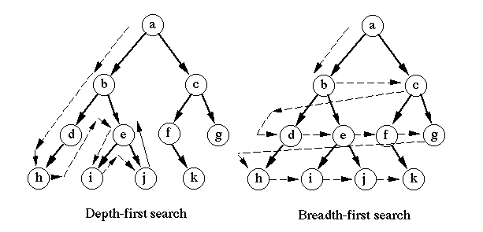
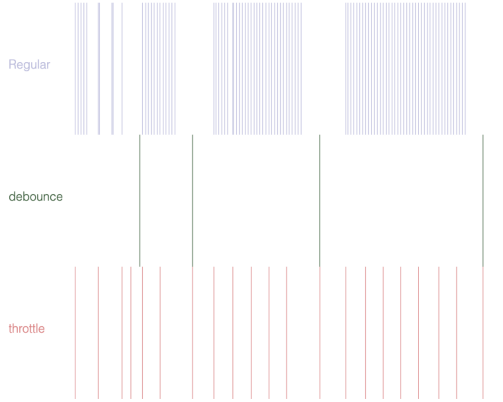
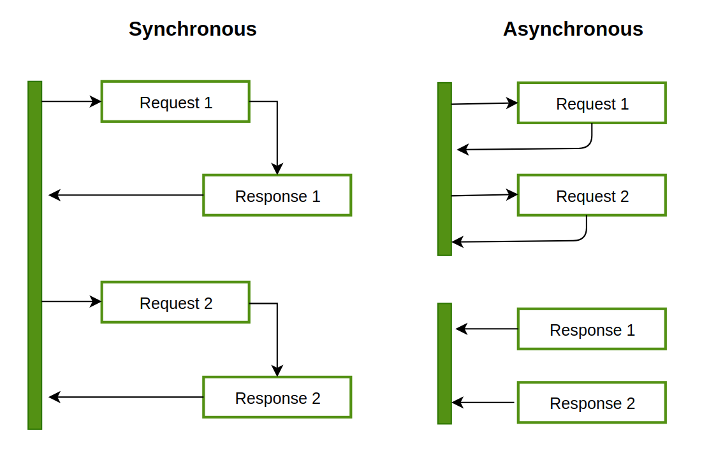

# **General**

## **Internet**
Internet is a global network of computers connected to each other which communicate through a standardized set of protocols. The internet is a design philosophy and an architecture expressed in a set of protocols.

### **Web Resources**

The target of an HTTP request is called a *resource*; it can be a document, a photo, or anything else. Each resource is identified by a *URI*.

#### **URIs, Uniform Resource Identifier**

A URI is a string that refers to a resource. URLs and URNs are types or URIs.

##### **URL, Uniform Resource Locator**

Also known as *web address* or *link*. Can be used in HTTP, FTP and SMTP protocols. Ex.: `https://developer.mozilla.org`

##### **URN, Uniform Resource Name**

URNs are persistent identifiers (long-lasting references) that refer to a resources without indicating its location or wether it still exist or not. Ex.: `urn:oasis:names:specification:docbook:dtd:xml:4.1.2`

##### **URI Syntax**

> http://www.example.com:80/path/to/myfile.html?key1=value1&key2=value2#SomewhereInTheDocument


| Section | Description |
| --- | --- |
| http:// | Protocol |
| www.example.com | Authority, domain name <br> or server being requested |
| :80 | Port |
| path/to/myfile.html | Path to resource on wer server |
| ?key1=value1&key2=value2# | Query: Extra parameters for web server |
| #SomewhereInTheDocument | ** Fragment: Anchor to a part of the resource itself |
<br>

> ** Ex.: In HTML, jumps to where the anchor is located; video or audio, jumps to the time the anchor represents.

**Important!**: What goes after `#` (fragment identifier) is not sent in the request to the server.

##### **Data URL**

URLs prefixed with the `data:` scheme, allow content creators to embed small files inline in documents.

> Syntax: `data:[<mediatype>][;base64],<data>`
```
data:,Hello%2C%20World!
//  Equals Hello, World! comma(%2C) and space(%20) are percent-encoded
//
data:text/plain;base64,SGVsbG8sIFdvcmxkIQ==
//  base64-encoded version of the above
//
data:text/html,%3Ch1%3EHello%2C%20World!%3C%2Fh1%3E
//  An HTML document with <h1>Hello, World!</h1>
//
data:text/html,<script>alert('hi');</script>
//  An HTML document that executes a JavaScript alert. Note that the closing script tag is required.
```
<br>

##### **MIME** (Multipurpose Internet Mail Extensions) **Types**

Is a standard that indicates the nature and format of a document, file, or assortment of bytes. Browsers use them instead of file extensions to know how to handle URL. They consist of a *type* and *subtype*. They could also contain optional *parameters*.
```
type/subtype
type/subtype;parameter=value

Ex.: 
text/plain;charset=UTF-8
```
<br>

###### **Other methods of conveying document type**
MIME types are not the only way to convey document type information:

- *Filename suffixes* are sometimes used, especially on Microsoft Windows. For Linux and MacOS they are not meaningful.
- *Magic numbers*. The syntax of different formats allows file-type inference by looking at their byte structure. For example, GIF files start with the 47 49 46 38 39 hexadecimal value (GIF89), and PNG files with 89 50 4E 47 (.PNG). Not all file types have magic numbers, so this is not 100% reliable either.

### **MISC**

#### **User Agent**

A computer program representing a person: browser, a bot, download manager. 

Browsers include a self-identifying User-Agent HTTP header called a user agent (UA) string attached to requests to server. This string often identifies the browser, its version number, and its host operating system. Javascript can access that string with the `NavigatorID.userAgent` property.

An user agent string:
```
"Mozilla/5.0 (X11; Ubuntu; Linux x86_64; rv:35.0) Gecko/20100101 Firefox/35.0"
```
<br>

### **HTTP**
In a typical HTTP request/response cicle:
- When data is requested the server sends it back in XML or JSON. 
- A requested image like JPEG, the server returns an image file.
- Something similar to the above happens with HTML pages, stylesheets and JavaScript code requested with responses of HTML file, CSS file and JS file accordingly.

**Standard ports**
- HTTP, port 80.
- HTTPS, port 443.

### **Responsive Web Design**
Make our website resizable. We use HTML and CSS to accomplish it.
```html
<meta name="viewport" content="width=device-width, initial-scale=1.0">
<!-- This makes it responsive-->
```
<br>

### **AJAX** (Asynchronous JavaScript And XML)
Not a programming language but a technique for accessing web servers from web pages. Uses a combination of:

- A browser built-in XMLHttpRequest object (to request data from a web server)
- JavaScript and HTML DOM (to display or use the data)

- AJAX transports data in any form. Commonly in: XML, JSON or plain text.
- Updates webpages asynchronously exchanging data with the webserver in the background. Then we can update websites without reloading them.

### **JSON** (JavaScript Object Notation)
A lightweight for storing and transferring data.

#### **Syntax**

- Data is in name/value pairs
- Data is separated by commas
- Curly braces hold objects
- Square brackets hold arrays

```json
{
"employees":[
    {"firstName":"John", "lastName":"Doe"},
    {"firstName":"Anna", "lastName":"Smith"},
    {"firstName":"Peter", "lastName":"Jones"}
]
}
```

Its syntax is derived from JS object notation syntax, but JSON is plain text. But any language can read and generate JSON.

### **`npm`** Node Package Manager

The world's largest software registry (library). You have to install *Node.js* to have access to *npm*. This and the name is due to that npm was first created as a package manager for Node.

All npm packages are defined in files called package.json. The content of package.json must be written in JSON. At least two fields must be present in the definition file: name and version.
```json
{
"name" : "foo",
"version" : "1.2.3",
"description" : "A package for fooing things",
"main" : "foo.js",
"keywords" : ["foo", "fool", "foolish"],
"author" : "John Doe",
"licence" : "ISC"
}
```
<br>

#### **Convert JSON text to JS**

A simple example is: 
```js
var text = '{ "employees" : [' + //JSON
'{ "firstName":"John" , "lastName":"Doe" },' +
'{ "firstName":"Anna" , "lastName":"Smith" },' +
'{ "firstName":"Peter" , "lastName":"Jones" } ]}';

//convert to JS object
var obj = JSON.parse(text); 
```
```html
<!-- Use in your website -->
<p id="demo"></p>

<script>
document.getElementById("demo").innerHTML =
obj.employees[1].firstName + " " + obj.employees[1].lastName;
</script>
```
<br>

### **jQuery**
JS library.

### **Angular**
AngularJS lets you extend HTML with HTML attributes called directives. Directives offers functionality to HTML applications. AngularJS provides built-in directives and user defined directives.

#### **AngularJS Directives**

Directives are HTML attributes with the prefix `ng-`. The `ng-app` directive initializes an AngularJS application. The `ng-init` directive initializes application data.

AngularJS uses double braces `{{ }}` as place holders for data.

```html
<div ng-app="" ng-init="message='Hello AngularJS!'">
  <h1>{{ message }}</h1>
</div>
```
<br>

### **Vue.js**

Allows you extend HTML with HTML attributes called directives.Directives offer functionality to HTML applications. Vue.js provides built-in directives and user defined directives

#### Vue.js Directives
Vue.js uses double braces `{{ }}` as place-holders for data.

Vue.js directives are HTML attributes with the prefix `v-`
```html
<div id="app">
<h1>{{ message }}</h1>
</div>

<!-- new Vue() creates a Vue Object-->
<!-- The property el: binds the new Vue object to the HTML element with id="app". -->
<script>
var myObject = new Vue({
    el: '#app',
    data: {message: 'Hello Vue!'}
})
</script>

```

## **Tuple**
Las tuples son inmutables. Luego de que se dimensionan y se les asigna un valor, estos no pueden ser modificados.

## *Roles de un arquitecto de software*. 
El arquitecto es el encargado de hacer que el producto (Software) sea creado con la calidad suficiente, y que cree valor al negocio. Pero para poder crear valor el producto debe ser mantenible, oportuno, suficiente y escalable. Hay es donde muchos conceptos incluyendo Design Patterns y Design Principles viene al la palestra. Tu producto o solución no crea valor si es un dragón de recursos, y eso no solo se limita al hardware sino a tiempo, dinero, calidad, y algunos puntos importantes. El Arquitecto es el encargado de velar por el balance de cada una de esas cosas:
- punto intermedio de comunicación entre los dueños o gerencia de la empresa, los clientes finales y los developers.
- Diseñar los sistemas que luego los Developers estarán haciendo.
- Estructurar (unir) todos esos sistemas para que funcionen como un uno solo.
- garante de algo llamado 'consistencia conceptual' del sistema como un todo.
Hay otros detalles que se consideran secundarios pero son importantes:
- mentor técnico de los developers en caso de ser necesario (seniors incluidos)
- lead en caso de ser necesario.


## **Diff between framework and platform**
There are a few important distinctions between a framework and a platform. A frame-work is usually just the code library used to build an application, whereas a platform is more holistic and  includes  tooling  and  support  beyond  a  framework.

## **DOM**


The DOM (Document Object Model) is created when the browser loads the page. 

The DOM exposes an interface, so that any language can manipulate it, not only JavaScript.

To manipulate and element we must find it. By ID is the best way.
```js
var myElement = document.getElementById("intro");
/* If found the element is assign as an object to myElement.
   If not found myElement = null.
*/
```

#### **What is the Difference Between the DOM and HTML Source Code?**
There are two instances the browser-generated DOM will be different than HTML source code:
- The DOM is modified by client-side JavaScript
- The browser automatically fixes errors in the source code.

## **Arguments and Parameters**

### Argument
Los argumentos son los valores o expresiones (que resultarán en valor) que le pasas a una función.

### Parameter
Y parámetro es la variable declarada en la firma del método que sostiene esos argumentos

## Expression, Computation and Evaluation
An expression is a combination of values, variables, and operators, which computes to a value.

The computation is called an evaluation.

For example, `5 * 10` evaluates to `50`:

<br>

_____
# **OOP**

OO is about ***simulating the real*** world in a computer.

## Use Case

Describes the *objects* that will be used to create the application. It also describes what *messages* (behavior) an object understands.

## **Abstraction** 

Knowing what something does without knowing how it does it. Hide what you want to hide and show what you want to show. Take out the individual characteristics and leave the common ones. Separate the unique traits and use only the shared ones.

## **Encapsulation** 

The actual action of hiding what it does. Forming an object that is independent in its functionality and features, packing within itself what it needs to interact with others.

## **Inheritance**

Taking the characteristics and behaviors of an element and assign to another one.

## **Polymorphism**. 

The ability an object has to transform in different things. Also to be able to do something in different ways. It's the ability of different objects to get the same message and react or respond differently.

There are 2 types of polymorphism:

- ***Dynamic polymorphism*** (al que nos referimos por defecto como polimorfismo). Also known as runtime polymorphism. This is when a overridden method is resolved at runtime.
- ***Static polymorphism*** (más raro y discutible si es real polimorfismo). It is also called compile time polymorphism. An example of it are methods overloading.

El primero se logra con method `override` y el segundo se logra con method `overloading`

## **Access Levels and Access Modifiers**

El nivel de acceso es una característica que controla que o traves de que se puede acceder al codigo que un elemento contiene. Los modificadores de acceso es lo que utilizamos para indicar el mencionado nivel, o sea,  especifican su accesibilidad y alcance (scope) en otras palabras su visibilidad.

La razón por la que a veces mencionan a la abstracción y encapsulación, es porque una envuelve a la otra.
La abstracción es más general, y la encapsulación es un mecanismo también para lograr un poco de abstracción, pero a diferente nivel.

Por ejemplo, cuando tienes todas las propiedades privadas en la clase String, cuando uso un objeto de tipo String y no puedo ver sus detalles al usar el punto, como s.arrayOfChars, entonces en cierto sentido sus detalles están abstraídos para mí, no puedo ver cómo está construido el objeto, esos detalles me están oculto, y por eso, están abstraídos, pero en este caso el mecanismo que logró esa abstracción fue la encapsulación. Pero como la abstracción es más amplia, hay más formas de abstraer, cómo meter la lógica en un método, etc.

## **composition vs inheritance**
    ¿Qué es cada una? ¿Cuáles son sus diferencias y similitudes? ¿Cuáles son las ventajas y desventajas de cada una? ¿Cuál es más recomendada?

### Concepts
#### Inheritance
Es un pilar de la OOP que nos permite extender el alcance de una clase tanto funcional como semanticamente al derivar una clase de otra. Nos permite establecer una relacion `IS a` entre 2 miembros/entidades/elementos (como prefieras llamarle a una clase).

#### Composition
Es una tecnica que nos permite tomar partes para armar un todo. Entendemos que una clase esta compuesta por varias otros tipos o clases. O sea, util e ideal cuando la relacion entre las clases es de `HAS a`.
 
- **Similitudes**
	- Reciclaje de codigo
	- Aplicacion de polimorfismo

- **Diferencias**
	- Inheritance
		- Relacion `IS a`
		- Todos los metodos y campos son pasados father a child
		- Tightly coupled  
	- Composition
		- Relacion `HAS a`
		- Solo hay acceso a los metodos deseados
		- loosely coupled

Entre otras

#### Ventajas y desventajas. Recomendada

Algo que he aprendido de los seniors aca es a ver las cosas mas preguntandome cuándo es mas util en vez de cuál es la mejor. Asi que, usamos Inheritance cuando entendemos que una nueva clase-hija es una version mas especifica y compleja que la clase-padre (hija `ES de` tipo padre). Y usamos composition cuando la clase guarda una relacion con otra y es parte de ella. Si bien es cierto que es posible lograr los mismos resultados con composition que podemos lograr con herencia y con el valor agregado de loose coupling,  cuando tenemos una estructura clara de nuestra solucion y entendemos que a nivel funcional y estructural una sub-clase ***es*** del tipo de una super-clase, siendo esa una relacion que nos sera de utilidad, entonces la herencia es el camino a tomar.

## Tight/Loose Coupling

Tight coupling is when a group of classes are highly dependent on one another.

This scenario arises when a class assumes too many responsibilities, or when one concern is spread over many classes rather than having its own class.

Loose coupling is achieved by means of a design that promotes single-responsibility and separation of concerns.

A loosely-coupled class can be consumed and tested independently of other (concrete) classes.

Interfaces are a powerful tool to use for decoupling. Classes can communicate through interfaces rather than other concrete classes, and any class can be on the other end of that communication simply by implementing the interface.

Example of tight coupling:
```java
class CustomerRepository
{
    private readonly Database database;

    public CustomerRepository(Database database)
    {
        this.database = database;
    }

    public void Add(string CustomerName)
    {
        database.AddRow("Customer", CustomerName);
    }
}

class Database
{
    public void AddRow(string Table, string Value)
    {
    
}
```

Example of loose coupling:
```java
class CustomerRepository
{
    private readonly IDatabase database;

    public CustomerRepository(IDatabase database)
    {
        this.database = database;
    }

    public void Add(string CustomerName)
    {
        database.AddRow("Customer", CustomerName);
    }
}

interface IDatabase
{
    void AddRow(string Table, string Value);
}

class Database implements IDatabase
{
    public void AddRow(string Table, string Value)
    {
    }
}
```
<br>

___
# **Functional Programming**

## **Memoization**
Es cuando una función es capaz de devolver el mismo resultado para inputs repetidos sin necesidad de ejecutarse de nuevo Como dijo @Carlos Gómez, la función maneja un caché de los inputs que ya ha trabajado y sus resultados. Cuando la llamas otra vez, revisa si ya había vistos esos inputs y si tiene el resultado guardado te lo devuelve desde el caché.


____
# **API**
Interface y API no es lo mismo. Pero sí, el DOM tiene cara de API y expone esa interface. JDBC expone la interface Connection, pero no tiene nada de funcionalidad. No es una API. Una API uno la llama para utilizarla en la creación de una app. O sea, ya tiene toda su funcionalidad. Y uno usualmente se comunica con esa API a través de alguna interface que ella expone. En este casi, interface no se refiere a la que no está implementada, simplemente a la cara del API, los métodos que expone, etc. La I de API, o sea Interface en este caso, no se refiere a una interface de un lenguaje que hay que implementar, simplemente se refiere a las formas o métodos que expone para comunicarte con ella.

____
# **Database**
- **Partitioning**:
    - *Horizontal*. Has separado en una base de datos una tabla con 100 columnas en varias de menos columnas para normalizar?
    - *Vertical*. Has separado en una base de datos una tabla con millones de records, en varias tablas con menos records, conde puedes elegir separarlas por categoría o lo que quieras. Si quieres separarlas por categoría, de una tabla products puedes hacer 10 tablas electronic_products, etc., y listo. Para que pesen menos.


____
# **Web Assembly (WASM)**
High-level single-threaded garbage-collected interpreted or just-in-time compiled prototype-based multi paradigm dynamic language with a non blocking event loop concurrency model


_____
# **Data Structures**

A way to organize data para facilitar su manipulacion mas adelante. 

**Arrays** 

Usada para almacenar un mismo tipo de dato en ubicaciones contiguas. Su tamaño debe ser indicado antes de almacenar datos.
- Complexity:
    - *Access O(1)*: Elementos almacenaados uno al lado del otro.
    - *Search O(n)*: para busquedas secuenciacles. > O(log n) para binarias en Arrays sorted.
    - *Insertion O(n)*:  el peor caso occurre cuando la insertion sucede al principio del array y se requiere mover todos los demas elementos.
    - *Deletion O(n)*: Cuando el borrado es al principio del arreglo y se requiere mover todos los elementos.

**Linked list**

Cada elemento (nodo) es un objeto por separado. Cada nodo esta compuesto por 2 elementos: los datos y una referencia al siguiente nodo. Esto da la ventaja de que el tamaño de la estructura puede expandirse or achicarse, pero el acceso a los datos no puede ser aleatorio: en arrays podemos acceder un elemento en O(1) pero en los lists O(n). 
- *Singly linked list*. Cada nodo apunta a el siguiente y el ultimo a NULL.
- *Double Linked list*. Cada nodo tienes 2 referencias: al anterior y al siguiente. El puntero anterior del primer nodo y el posterior del ultimo son NULL.
- *Circular Linked list*. Todos los nodos estan conectados para formar un circulo. Pueden ser Singly o Double. Cualquier nodo puede ser el punto de inicio. Ej.: el ultimo nodo apunta al primero.
- Complexity:
    - *Access O(n)*: Tengo que recorrer cada elemento para encontrar el que tiene el puntero que apunta al que quiero.
    - *Search O(n)*.
    - *Insertion O(1)*:  Si sabemos la posicion donde queremos insertar.
    - *Deletion O(1)*: Si sabemos la direccion del nodo que apunta al elemento a eliminar.

**Tipos de estructuras de datos de abstraccion**

**Stack**

Tambien conocido como LIFO(last in, first out) sirve como una coleccion de elementos con dos operaciones principales: push, que agregar un elemento y pop, que lo remueve; Peek or Top: regresa al elemento de arribe del stack, isEmpty, devuelve true si stack esta vacio.. Ambas operaciones se hacen en el mismo extremo del stack, la parte de arriba. Se puede implementar con arreglso o con linked list:
- Complexity:
    - *Access O(n)*: 
    - *Insertion O(1)*: 
    - *Deletion O(1)*:
Ej.: Para manejar las llamadas a funciones ( la ultima llamda debe finalizar su ejecucion primero), en editores de texto para hacer undo donde la ultima palabra insertada es la que se borra.

**Queue**

FIFO(First in, first out). Como stack cuenta con dos opereaciones: enqueue, agrega elementos atras de la cola, dequeue, remueve desde el frente de la fila, Front, ir al frente del queue; ir a la parte de atras del queue. Tambien puede imprementarse son aray y linked list.
Ej.: Situaciones en recursos son compartidos entre diferentes usuarios y servicdas al primero que llegue. CPU scheduling, disk scheduling
Circular Queue, The advantage of this data structure is that it reduces wastage of space in case of array implementation, As the insertion of the (n+1)’th element is done at the 0’th index if it is empty.

**Binary Tree**

Estructura de datos herarquica no lineal como Arrays, List, Stack y Queue. Cada nodo tiene 2 ninos: izquierdo y derecho. Se implementa principalmente con links. Es representado por un puntero al nodo root. Cuando el arbol esta vacio root es NULL. Un nodo contiene: data, puntero al hijo izquierdo, puntero al derecho. Se puede recorrer de dos maneras:

-Travesia Depth First: 
   - *Inorder* (Left-Root-Right). 
   - *Preorder* (Root-Left-Right). Usualmente usado para copiar el arbol
   - *Postorder* (Left-Right-Root). Usualmente para borrar el arbol.
-*Travesia Breadth First*: Level Order Traversal

Puedes saber varias informaciones sobre un arbol segun sus propiedades: 
1. El numero maximo de nodos en nivel  x es igual a 2^x
2. El numero maximo de nodos en el arbol 2^x-1
3. Numero minimo de niveles Log2(N+1) donde N es la cantidad de nodos
4. En un arbol cuyos todos nodos tienen 0 o 2 hijos el numero de nodos hoja es siempre uno mas que el numero totalt de nodos con 2 hijos.

Nodes:
- Successor: The left most node of my first right node.
- Predecessor: The right most node of my first left node.

Types od Trees:
- *Full*:  Cada nodo tiene 0 o 2 hijos
- *Complete*: Todos los niveles estan completos. Se acepta que el ultimo no.
- *Perfect*: Todos los nodos internos tienes sus hijos y los nodos hoja al mismo nivel.
- *Degenerate, pathological*. Cada nodo interno tiene solo un hijo. A nivel de desempeño es igual a un linked list.
Balanced.

**Binary Search Tree**
- El subarbol a la izquierda todos sus nodos tienen un valor menor a root y en cada nivel menor a su padre.
- El subarbol a la derecha contiene valores iguales or majores a root. Aunque otro lado me dice que no debe haber duplicates.

Search:

Algorithm:
```
Search (ROOT, ITEM)

Step 1: IF ROOT -> DATA = ITEM OR ROOT = NULL
    Return ROOT
   ELSE
   IF ROOT < ROOT -> DATA
   Return search(ROOT -> LEFT, ITEM)
  ELSE
   Return search(ROOT -> RIGHT,ITEM)
  [END OF IF]
  [END OF IF]
Step 2: END
```

<u>*Insert*</u>: Se hace un search hasta que se llega al leaf que se convertira en su padre y se coloca a izquierda o derecha dependiendo si es mayoiur or menor.

<u>*Delete*</u>:
1 - Si es leaf solo se borra o se iguala a Null
2 - Si es un nodo con un solo hijo se intercambian los valores y ahora que el nodo pasa a ser un leaf

HashMap, HashSet, Balanced Tress, Grafos, al bruja, la recursión. Con un par de ejemplos, fibonacci, caching, time y space complexity, etc.

<br>

______
# **Browser Console**

Open: `Ctrl` + `Shift` + `I` || F12 || Right-click > Inspect Element.

If you list multiple objects they will be concatenated into a single, space-delimited string, which is then output to the console.
```js
console.log('This is a string', { foo: 'bar' }, { bar: 'foo' });
// OUTPUT: This is a string {foo: "bar"} {bar: "foo"}
```

The first parameter can contain format specifiers that allow you to define the format and positioning, of the subsequent objects.
```js
var number = 11 * 9;
var color = 'red';

console.log('%d %s balloons', number, color);
//OUTPUT: 99 red balloons
```

|FORMAT SPECIFIER |	DESCRIPTION |
|-----|---|
| %s	| String |
|%d or %i |	Integer |
|%f	| Floating point value |
|%o	| Expandable DOM element (as displayed in the ‘Elements’ tab of the dev tools) |
|%O	| Expandable JavaScript object|
|%c	| Formats the output using the CSS style you provide |

Using the %c format specifier allows you to style the console output.
```JS
console.log('%cThis text is styled!', 'color: #86CC00; background-color: blue; font-size: 20px; padding: 3px;')
```
**`alert()`**. Another way of creating output that you can see. But `console.log` is the preferred one.

## **Input**
Use the function prompt(..)
```js
age = prompt( "Please tell me your age:" );
console.log( age );
```

## **`console.assert(expression, object)`**. 
If the result of the expression is false the object will be printed in the console.
```js
var count = 5;
console.assert(count > 10, 'count is not larger than 10');
//OUTPUT: Assertion failed: count is not larger than 10
```
## **`console.clear()`**. 
Clears any output in the console window.

## **`console.count(label)`**. 
Method will output the number of times that the `count()` method has been called. You will only get an accurate count if this method is called at the same line, with the same label each time. This method can be useful for finding out how many times a function is being called in your code.
```js
function clickHandler() {
    console.count('Click handler called');
    ...
}

for (var i = 0; i < 3; i++) {
    clickHandler();
}
/* OUTPUT:
Click handler called: 1
Click handler called: 2
Click handler called: 3
*/
```

## **`console.dir(object)`**. 
Prints a JavaScript representation of the supplied object to the console. This method is especially useful for examining HTML elements, as it will display the DOM representation of the element rather than the XML representation displayed when using `console.log()`.
```js
console.dir(document.body);
```

## **`console.dirxml(object)`**
Prints the XML representation of on a object.
```js
console.dirxml(document.body);
```

## **`console.error(object [, object, …])`**
Takes one or more objects and prints them to the console. Will also print a stack trace from where the method was called. The output will also be flagged as an error in the console.
```js
console.error('Page not found (404)');
/*OUTPUT
Page not found (404)
(anonymous) @ VM717:1
*/
```

## **`console.group(object[, object, …])` & `console.groupEnd()`**
Groups together log messages.
```js
console.log("This is the outer level");
console.group("First group");
console.log("In the first group");
console.group("Second group");
console.log("In the second group");
console.warn("Still in the second group");
console.groupEnd();
console.log("Back to the first group");
console.groupEnd();
console.debug("Back to the outer level");
```

## **`console.groupCollapse()`**
Equal to the prev but groups are displayed collapse.
```js
console.groupCollapsed('Fetching Data');
console.log('Request Sent');
console.error('Error: Server not responding (500)');
console.groupEnd();
console.log('Continuing...');
```

## **`console.info(object [, object, …])`**
Equal to `console.log() except that log messages are  given the info flag.
```js
consol.info('Hello Treehouse');
```

## **`console.warn(object [, object, …])`**
Logs a message to the console with a warning flag.
```js
console.warn(‘This is a warning.’);
```

## **`console.profile([profile]) & console.profileEnd()`**
Starts a new JavaScript CPU performance profile if the developer tools are open.
```js
function animationUI() {
    console.profile('Animating');
    // Animate something...
    console.profileEnd();
}
``` 

## **`console.table(data)`**
Allows you to output structured data as an interactive table in the console.
```js
var data = [
    {first_name: 'Matt', last_name: 'West', occupation: 'Programmer'},
    {first_name: 'Vince', last_name: 'Vaughn', occupation: 'Actor'},
    {first_name: 'Larry', last_name: 'Page', occupation: 'CEO'}  
];

console.table(data);
```
This method can be really handy for examining data returned by an AJAX call.

## **`console.time(label) & console.timeEnd(label)`**
These methods give you a way of timing how long it takes for a piece of code to execute. Both the `time()` and `timeEnd()` methods should be passed the same label parameter.
```js
console.time('Draw frame');
// Execute some code...
console.timeEnd('Draw frame');
//POSSIBLE OUTPUT
// Draw frame: 0.28125 ms
```

## **`console.timeline(label)` & `console.timelineEnd(label)`**
Allows you to make a new timeline recording in the Chrome developer tools.
```js
console.timeline('Google Search');

// Do some work.

console.timelineEnd('Google Search');
```
## **`console.timeStamp(label)`**
Manually add events to the timeline. Adds a single marker to the browser's Performance or Waterfall tool. This lets you correlate a point in your code with the other events recorded in the timeline, such as layout and paint events.

## **`console.trace()`**
Prints a stack trace for the point at which the method was called.
```js
function foo() {
  function bar() {
    console.trace();
  }
  bar();
}

foo();
/*
console.trace
bar @ VM498:3
foo @ VM498:5
(anonymous) @ VM498:8
*/
```
<br>

____
# **Good To Know**

## **Chrome tabs resource usage.** 
Cada tab en Chrome tiene su proprio mundo. Event loop, stack, etc. Hence the amount of resourced it uses.

<br>

_____
# **MISC Concepts**

## **UUID**

Universally unique identifier is a 128-bit value to identify information. Also known as GUID (Globally Unique Identifier) mostly in microsoft.

## **Cross Site Scripting (XSS)**

An attacker uses a web application to send malicious code via a script. Flaws that allow these attacks to succeed are quite widespread and occur anywhere a web application uses input from a user within the output it generates without validating or encoding it.

## **SQL Injection**

SQL injection is the placement of malicious code in SQL statements, via web page input. SQL injection usually occurs when you ask a user for input, like their username/userId, and instead of a name/id, the user gives you an SQL statement that you will unknowingly run on your database.

## **Depth-First vs Breadth-First Search**



## **Debounce vs Throttle**



## **Synch vs Async**

