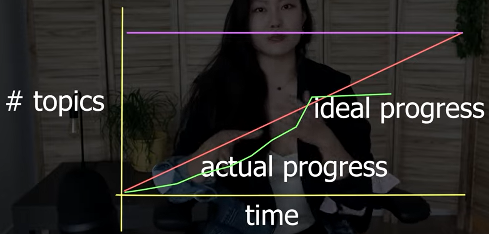

# General Study
## Achieve Consistency in studying

1. Have a goal
2. What pushes your button 
3. Adapting your mind set
4. Having a support system
5. Measure your progress

## How to study

1. **Have clear picture of your end role**. Which will serve as a north and motivation.

2. Use 10% of the time you think it will take you to go through the whole process to decide which courses to take.

3. **Executing**. Disciplines:
	1- Focus on what's most important. Like completing the right course, after determine what the right course is.
	2- Act on lead measures (metrics). Lead metrics are like sub-goals that by completing them you will achieve your general goal (lagging metric, what you picture yourself being able to do with the skill you will acquire).
		- Lagging: being able to build a website.
		- Leading: the concepts of the roadmap of web developing.
	3- Keep score board. Most learning webpages keep those for you. But you can do that your self with the topics with want to learn
	4- Create accountability

4. **Skip fluff + use multiple resources**. You don't have to follow all course faithfully. If you see fit you can take what you need from the courses you've chosen and skip unnecessary sections of the course.

5. **How to take notes**. One technique is take notes on highly abstract concepts and record references to the places you learned that particular subject from for future reference.

6. ***Extra***. **Principle of directness and drilling**. POD is applying what you are learning to your end goal. In coding, apply what learn to a personal project while learning. Drilling means dividing complex subjects in its individual parts and working on your weak parts and improve these areas individually.

# Learn to Learn Coding

1. Hard work over talent.
2. Learn patterns. Don't memorize syntax. Get tools in your brain that allows you to create solutions on any language
3. Stop watching and ***DO***. Code at least a couple os hours a day.
4. Stay Healthy.
5. Feynman Technique. 
	- Choose a topic.	Choose topic to learn: build a website with JS.
	- Explain it to a 12 year old.	Explain the tech
	- Reflect, refine, simplify. Build something. Anything that functions as quickly as possible.
	- Organize and review.	Go back refactor and simplify. Share it if possible to get feedback.
6. Dopamine hits. Because learning to code is painful a reward is needed. Helps get addicted to coding.
7. Don't work to hard. Pace yourself and take regular breaks.
8. Think like an engineer. Google what you want to learn and go from there; that is essentially what you will be doing all the time.