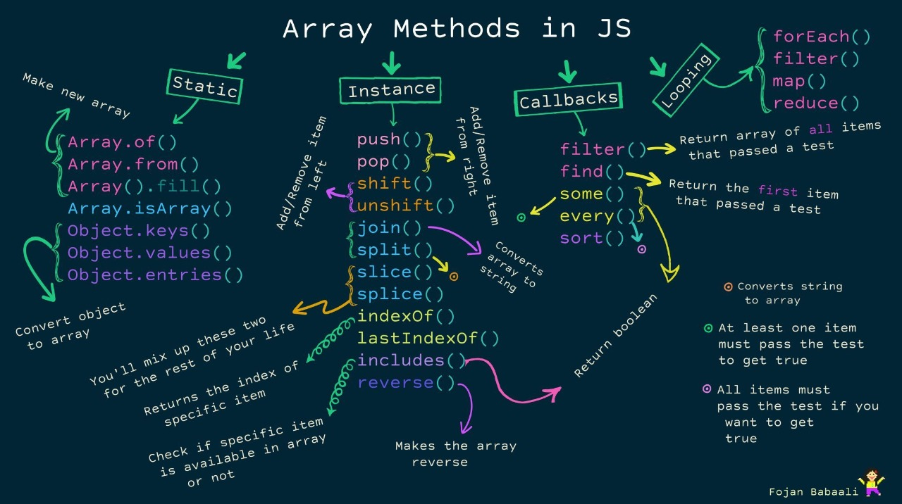

# **JavaScript**

Unlike most programming languages, the JavaScript language has no concept of input or output. It is designed to run as a scripting language in a host environment, and it is up to the host environment to provide mechanisms for communicating with the outside world. The most common host environment is the browser, but JavaScript interpreters can also be found in a huge list of other places.

## **History**

Made by Brendan Eich in 1995 for Netscape 2. Became ESMA-262 standard in 1997.

# **Basics**

## **Variables**

JS has 8 different data types: `undefined, null, boolean, string, symbol, bigint, number,` and `object.`

```js
let ourName;
/* In JavaScript we end statements with semicolons.
 Variable names can be made up of numbers, letters, 
and $ or _, but may not contain spaces or start with 
a number.*/
```

Declared variables in JS have an initial value of `undefined`. If you do a mathematical operation on an `undefined` variable your result will be `NaN` which means _"Not a Number"_. If you concatenate a string with an `undefined` variable, you will get a literal string of "undefined".

You can declare several variables on one single statement separating them with coma:

```js
var person = 'John Doe',
  carName = 'Volvo',
  price = 200;
```

<br>

### **Scope**

Variables declared with `var`, `let` and `const` inside a function have function scope. However, `var` cannot have a block scope.

#### **Global**

Apart from variables declared globally, variables that were initialized without being declared become global automatically. However, that doesn't happen on _strict mode_.

```js
myFunction();

// code here can use carName

function myFunction() {
  carName = 'Volvo';
}
```

<br>

### **Primitives vs Objects**

Primitives values are values with no properties or methods. Primitives data types hold primitive values. All primitives values in JS (`'Hola'`, `3.14`, `true`, etc) are hardcoded therefore immutable.

#### Primitives data types

string, number, boolean, null, undefined

#### Object types

Dates are always objects, Maths, Regular expressions, Arrays, Functions and Objects. Booleans, Numbers and String can be objects (if defined with the new keyword). All _values_ that are not primitives.

### Re-Declaring JavaScript Variables

If you re-declare a JavaScript variable, it will not lose its value.

```js
var carName = 'Volvo';
var carName;
// Still Volvo
```

<br>

### `const` Not Real Constants

Objects (including arrays and functions) assigned to a variable using const are still mutable. Using the const declaration only prevents reassignment of the variable identifier.

```js
const s = [5, 6, 7];
s = [1, 2, 3]; // throws error, trying to assign a const
s[2] = 45; // works just as it would with an array declared with var or let
console.log(s); // returns [5, 6, 45]
```

When we use to declare we are not defining a constant value but a constant reference to a value. This explains why we cannot change primitive values but we can change properties of const objects.

<br>

### **String**

Strings in JavaScript are sequences of Unicode characters. More accurately, they are sequences of UTF-16 code units; each code unit is represented by a 16-bit number. Each Unicode character is represented by either 1 or 2 code units.

Did we mention that you can use strings like objects too? They have methods as well that allow you to manipulate the string and access information about the string:

```js
'hello'.length; // 5
'hello'.charAt(0); // "h"
'hello, world'.replace('world', 'mars'); // "hello, mars"
'hello'.toUpperCase(); // "HELLO"
```

<br>

But then if in JS strings are primitive why they have access to methods like objects.

```js
var str = 'hello';
console.log(str.toUpperCase()); // --> HELLO
```

It appears that str clearly has a toUpperCase property. Was our inference incorrect? Specifically, if strings are not objects, why do they have properties like toUpperCase, toLowerCase, etc…? <br>
**Short answer**: JavaScript promptly coerces between primitives and objects. <br>
**Long answer**: whenever you try to access a property of a string str, JavaScript coerces the string value to an object, by new String(str). This object is called a wrapper object. It inherits all string methods, and is used to resolve the property reference. Once the property has been resolved, the wrapper object is discarded.

> Note: the same concept applies to numbers and booleans.

When you are defining a string you must start and end with a single or double quote. You can escape a quote from considering it as an end of string quote by placing a backslash (\) in front of the quote.

```js
let sampleStr = 'Alan said, "Peter is learning JavaScript".';
```

**Escape Sequences** <br>
| **Code** | **Output** |
| -------- | ---------- |
| \\' | single quote |
| \\" | double quote |
| \\\ | backslash |
| \\n | newline |
| \\r | carriage return |
| \\t | tab |
| \\b | word boundary |
| \\f | form feed |
<br>

Ex.:

```js
let myStr;
myStr = 'FirstLine\n\t\\SecondLine\nThirdLine';
/*
The string looks like:
"FirstLine
	\SecondLine
ThirdLine"
*/
```

<br>

#### **Concatenation**.

We use the `+` sign to concatenate in
:

```js
let myStr; // Change this line
myStr = 'This is the start. ' + 'This is the end.';
// = This is the start. This is the end.
```

<br>

#### **`.length`**

Se puede usar:

```js
let firstName = 'Frank';
let firstNameLength1 = firstName.length;
let firstNameLength2 = 'Frank'.length;
// firstNameLength1 =  firstNameLength2 > 5 = 5
```

<br>

#### **Bracket Notation**

Gets a character at a specific index within a string.

```js
var firstName = 'Charles';
var firstLetter = firstName[0]; // 'f'
```

String values are immutable, which means that they cannot be altered once created. Note that this does not mean that string cannot be changed, just that the individual characters of a string literal cannot be changed. The only way to change a string would be to assign it with a new string:

```js
var myStr = 'Bob';
myStr = 'Job';
```

<br>

#### **`Template Literals`**

Allow you to create multi-line strings and to use string interpolation features to create strings.

```js
const person = {
  name: 'Zodiac Hasbro',
  age: 56,
};

// Template literal with multi-line and string interpolation
const greeting = `Hello, my name is ${person.name}!
I am ${person.age} years old.`;

console.log(greeting); // prints
// Hello, my name is Zodiac Hasbro!
// I am 56 years old.
```

Several things about the code above:

- Back sticks (`), not quotes (' or "),
- The string is multi-line, both in the code and the output. This saves inserting \n within strings.
- The ${variable} syntax is a placeholder. Basically, you won't have to use concatenation with the + operator. Similarly, you can include other expressions in your string literal, for example ${a + b}.

#### **String Methods**

All string methods return a new string and don't modify the original.

##### **`indexOf()` vs `search()`**

They both search for an specified value inside a string and return its position. Their differences:

- The search() method cannot take a second start position argument.
- The indexOf() method cannot take regular expressions.
  <br>

##### **`slice()`, `substring()` and `substr()`**

They all extract part of a string returning a new string.

- `slice()`.
  - Two parameters: start and end positions (end not included).
  - Negative parameters to start from the end of the string.
  - If the second parameters is omitted it takes the rest of the string.
- `substring()`. Similar to slice() but it does not accept negative values.
- `substr()`. Differs from slice() because the second parameter is the length of the extracted part.

```js
// slice
var str = "Apple, Banana, Kiwi";
var res = str.slice(7, 13); //Banana
var res = str.slice(-12, -6); // Banana
i can eat banana
//substring
var res = str.substring(7, 13); //Banana

//substr
var res = str.substr(7, 6); //Banana
```

##### **`split()`**

Converts a string in an array.

```js
let txt = 'a,b,c,d';
let arr = txt.split(',');
```

-If the separator is omitted the whole string in stored in index 0.
-If separator is `""` then each character is stored in a separate index.

<br>

### **Numbers**

Numbers in JavaScript are "double-precision 64-bit format IEEE 754 values", according to the spec — There's no such thing as an integer in JavaScript

| Value            | (aka Fraction/Mantissa) | Exponent Sign |
| ---------------- | ----------------------- | ------------- |
| 52 bits (0 - 51) | 11 bits (52 - 62)       | 1 bit (63)    |

```js
console.log(3 / 2); // 1.5, not 1
console.log(Math.floor(3 / 2)); // 1
```

So an apparent integer is in fact implicitly a float.

`Math` provides advanced mathematical functions and constants:

```js
Math.sin(3.5);
var circumference = 2 * Math.PI * r;
```

<br>

#### **Precision**

Integers (numbers without a period or exponent notation) are accurate up to 15 digits. The maximum number of decimals is 17.

```js
var x = 999999999999999; // x will be 999999999999999
var y = 9999999999999999; // y will be 10000000000000000
//
var x = 0.2 + 0.1; // x will be 0.30000000000000004
```

<br>

#### **Methods**

Some of the useful methods for numbers are:

- **`.toString()`**.
- **`.toExponential()`**. Work with exponential notation.
- **`.toFixed(n)`**, n = number of decimals. 
- **`.toString(n)`**, n = length of a number. 
- **`.valueOf()`**, returns a number as number. In JS primitives can be numbers or objects.
- **`.parseFloat()`**. Allows spaces. 

All number methods can be used on any type of numbers (literals, variables, or expressions):

```js
Example;
var x = 123;
x.toString(); // returns 123 from variable x
(123).toString(); // returns 123 from literal 123
(100 + 23).toString(); // returns 123 from expression 100 + 23
```

<br>

##### **`parseInt()`**

```js
parseInt('123', 10); // 123
parseInt('010', 10); // 10
```

You can parse floating point numbers using the built-in `parseFloat()` function. Unlike its `parseInt()` cousin, `parseFloat()` always uses base 10.

The `parseInt()` and `parseFloat()` functions parse a string until they reach a character that isn't valid for the specified number format, then return the number parsed up to that point. However the "+" operator simply converts the string to NaN if there is an invalid character contained within it.

You can also use the unary `+` operator to convert values to numbers:

```js
+'42'; // 42
+'010'; // 10
+'0x10'; // 16
```

It takes a second argument for the radix, which specifies the base of the number in the string. The radix can be an integer between 2 and 36.

```js
var a = parseInt('11', 2);
//The radix variable says that "11" is in the binary system, or base 2. Converts the string "11" to an integer 3.
```

If the first character in the string can't be converted into a number, then it returns NaN.

NaN es lo único en Javascript que no es igual a sí mismo. Podría ser cualquier cosa pero lo unico que se sabe es que no es un número.

**NaN is toxic:** If you provide it as an operand to any mathematical operation, the result will also be NaN:

```js
NaN + 5; // NaN
```

<br>

#### **`Infinity`**

A value outside the largest possible number.

```js
//txt == Infinite after 1.3407807929942597e+154
var myNumber = 2;
var txt = '';
while (myNumber != Infinity) {
  myNumber = myNumber * myNumber;
  txt = txt + myNumber + '<br>';
}
```

And when divided by `0`.

### **Arrays**

- Nested:

```JS
var myArray = [[]];
var myArray2 = [["Bulls", 23], ["White Sox", 45]];
```

**Note:**
There shouldn't be any spaces between the array name and the square brackets, like `array [0]`. Although JavaScript is able to process this correctly, this may confuse other programmers reading your code.

Unlike strings, the entries of arrays are mutable and can be changed freely.

#### _Multidimensional Array_.

```js
var arr = [
  [1, 2, 3],
  [4, 5, 6],
  [7, 8, 9],
  [[10, 11, 12], 13, 14],
];
arr[3]; // equals [[10,11,12], 13, 14]
arr[3][0]; // equals [10,11,12]
arr[3][0][1]; // equals 11
```

<br>

#### **Accessing Nested Arrays**

```js
const ourPets = [
  {
    animalType: 'cat',
    names: ['Meowzer', 'Fluffy', 'Kit-Cat'],
  },
  {
    animalType: 'dog',
    names: ['Spot', 'Bowser', 'Frankie'],
  },
];
ourPets[0].names[1]; // "Fluffy"
ourPets[1].names[0]; // "Spot"
```

<br>

#### **`.push()`**,

Takes one or more parameters and "pushes" them onto the end of the array.

```js
var arr1 = [1, 2, 3];
arr1.push(4);
// arr1 is now [1,2,3,4]

var arr2 = ['Stimpson', 'J', 'cat'];
arr2.push(['happy', 'joy']);
// arr2 now equals ["Stimpson", "J", "cat", ["happy", "joy"]]
```

<br>

#### **`.unshift()`**

Works exactly like .push(), but instead of adding the element at the end of the array, unshift() adds the element at the beginning of the array.

```js
var ourArray = ['Stimpson', 'J', 'cat'];
ourArray.shift(); // ourArray now equals ["J", "cat"]
ourArray.unshift('Happy');
// ourArray now equals ["Happy", "J", "cat"]
```

<br>

#### **`.pop()`**

Is used to "pop" a value off of the end of an array. We can store this "popped off" value by assigning it to a variable. In other words, .pop() removes the last element from an array and returns that element.
Any type of entry can be "popped" off of an array - numbers, strings, even nested arrays.

```js
var threeArr = [1, 4, 6];
var oneDown = threeArr.pop();
console.log(oneDown); // Returns 6
console.log(threeArr); // Returns [1, 4]
```

<br>

#### **`.shift()`**

Just like `.pop()` but it removes the first element instead of the last

```js
var ourArray = ['Stimpson', 'J', ['cat']];
var removedFromOurArray = ourArray.shift();
// removedFromOurArray now equals "Stimpson" and ourArray now equals ["J", ["cat"]].
```

<br>

#### **`concat()`**

Creates a new array merging the indicated ones.

```js
let myGirls = ['Cecilie', 'Lone'];
let myBoys = ['Emil', 'Tobias', 'Linus'];
let myChildren = myGirls.concat(myBoys); // Concatenates (joins) myGirls and myBoys
```

<br>

#### **`slice()`**

Slices a piece of an array into a new array

```js
var fruits = ['Banana', 'Orange', 'Lemon', 'Apple', 'Mango'];
var citrus = fruits.slice(1);
//This snippet starts on Orange
```

With two arguments slice selects elements from the start argument and up to the end argument exclusive.

```js
var fruits = ['Banana', 'Orange', 'Lemon', 'Apple', 'Mango'];
var citrus = fruits.slice(1, 3);
// Returns [Orange,Lemon]
```

<br>

#### **Sorting**

Alphabetical sorting is accomplished by simply using `sort()`:

```js
var fruits = ['Banana', 'Orange', 'Apple', 'Mango'];
fruits.sort();
```

<br>

##### **Sorting numbers**

To numbers you supply a function as argument that sort uses to compare (_compare function_) the elements of the array :

```js
const sortAscending = (x, y) => x - y;
let numSort = [0, 11, 100, 2, 4, 500, 33].sort(sortAscending);
//
const sortDescending = (x, y) => y - x;
```

<br>

###### **Compare Function**

When the `sort()` function compares two values, it sends the values to the compare function, and sorts the values according to the returned (negative, zero, positive) value. For ascending order:

- If the result is negative a is sorted before b.
- If the result is positive b is sorted before a.
- If the result is 0 no changes are done with the sort order of the two values.

##### **Ramdom Sorting. Fisher Yates Method**

```js
var points = [40, 100, 1, 5, 25, 10];

for (i = points.length - 1; i > 0; i--) {
  j = Math.floor(Math.random() * i);
  k = points[i];
  points[i] = points[j];
  points[j] = k;
}
```

<br>

##### **Sorting Arrays of Objects**

Write a function that compares the property values:

```js
var cars = [
  { type: 'Volvo', year: 2016 },
  { type: 'Saab', year: 2001 },
  { type: 'BMW', year: 2010 },
];

cars.sort(function (a, b) {
  return a.year - b.year;
});
// This works even with properties of different data types
```

For string properties:

```js
cars.sort(function (a, b) {
  var x = a.type.toLowerCase();
  var y = b.type.toLowerCase();
  if (x < y) {
    return -1;
  }
  if (x > y) {
    return 1;
  }
  return 0;
});
```

<br>

##### **Find Highest/Lowest**

1. You can sort the array in asc/desc order then get the corresponding first/last element for the array.
2. Math.max/Math.min:

```js
function myArrayMax(arr) {
  return Math.max(arr);
}
//
function myArrayMin(arr) {
  return Math.min(arr);
}
```

3. The fastest is to make your own method. Example:

```js
function myArrayMax(arr) {
  var len = arr.length;
  var max = -Infinity;
  while (len--) {
    if (arr[len] > max) {
      max = arr[len];
    }
  }
  return max;
}
```

<br>

#### **Iteration**

The callback functions used by these methods accept other parameters apart from value, but they can be omitted if only value will be used.

```js
function myFunction(value, index, array) {
  //
}
//Could be
function myFunction(value) {
  //
}
```

<br>

##### **`forEach()`**

Calls a function (a callback function) once for each array element.

```js
var arrMultiplied = '';
var numbers = [45, 4, 9, 16, 25];
numbers.forEach(myFunction);

function myFunction(value) {
  value *= 2;
  arrMultiplied = arrMultiplied + value + '\n';
}

console.log(arrMultiplied);
```

<br>

The function actually takes 3 arguments: item value, item index and the array itself but the example above uses only the value parameter.

##### **`map()`**

Creates a new array by performing a function on each array element. It does not execute the function for array elements without values.

```js
var numbers = [45, 4, 9, 16, 25];
var numbersByTwo = numbers.map(myFunction);

function myFunction(value) {
  return value * 2;
}

console.log(numbersByTwo); // [90, 8, 18, 32, 50]
```

<br>

##### **`reduce()`**

The parameters currentIndex, arr and initialValue are optional.

Runs a function on each array element to produce (reduce it to) a single value. It runs left-to-right in the array. `reduceRight()` does it backwards.

_Syntax:_
`array.reduce(function(total, currentValue, currentIndex, arr), initialValue)`

- The `total` is the initial/previously returned value
- The `currentValue` is the item value
- The `currentIndex` is the item index
- `arr` is the array itself
- The `initialValue` is the value you want the final result to start with.

The last 3 are optional.

```js
var numbers = [45, 4, 9, 16, 25];
var numbersSum = numbers.reduce(myFunction);

function myFunction(total, value) {
  return total * value;
}

console.log(numbersSum); // 648000
```

```js
let arrSum = [1, 2, 3, 4, 5];

let addition = arrSum.reduce((a, b) => a + b);
console.log(addition);
// Prints 15
```

<br>

##### **`every()` vs `some()`**

`every()` method check if all array values pass a test.

`some()` checks if al least one value passes a test.

```js
var numbers = [45, 4, 9, 16, 25];
var allOver18 = numbers.every(myFunction1); // false
var someOver18 = numbers.some(myFunction2); // true

function myFunction(value) {
  return value > 18;
}
```

<br>

##### **`indexOf()`, `lastIndexOf()`**

`indexOf()` method searches an array for an element value and returns the position of its first occurrence. Returns -1 if the item is not found.

`lastIndexOf()` returns the position of the last occurrence.

```js
var fruits = ['Apple', 'Orange', 'Apple', 'Mango'];
var a = fruits.indexOf('Apple'); // 0
var a = fruits.lastIndexOf('Apple'); /// 2
```

<br>

##### **`find()`, `findIndex()`**

`find()` method returns the value of the first array element that passes a test function.

`findIndex()` returns the index.

```js
var numbers = [4, 9, 16, 25, 29];
var firstValue = numbers.find(myFunction); // 25
var firstIndex = numbers.findIndex(myFunction); // 3

function myFunction(value, index, array) {
  return value > 18;
}
```

<br>

#### **Adding Properties to Arrays**

Since arrays are a type of object in JS, we can add any value to it including object properties. But if the key of the property being added is not indexable (not a number) then 5that element is not counted towards its length:

```js
var arr = [1, 2, 3];
console.log(arr + ' ' + arr.length); //3

arr['4'] = 'test1';
console.log(arr + ' ' + arr.length); // 5

arr.etc = 'test2';
console.log(arr + ' ' + arr.length); // 5. Length doesn't increase
```

The added `etc` property is not printable by console.log

<br>

#### **Array Methods Summary**



<br>

#### **Determine If An Array**

Since typeOf(arr) returns object, then try:

```js
const arr = [];
// Solution 1
console.log(Array.isArray(arr));

// Solution 1 Create your own method
const isArray = (x) => x.constructor.toString().indexOf('Array') > -1;
console.log(isArray(arr));
// Returns true if the object prototype contains the word "Array".

// Solution 3
console.log(arr instanceof Array);
```

<br>

### _Destructuring an array:_

```js
const [a, b] = [1, 2, 3, 4, 5, 6];
console.log(a, b); // 1, 2
```

The variable a is assigned the first value of the array, and b is assigned the second value of the array. We can also access the value at any index in an array with destructuring by using commas to reach the desired index:

```js
const [a, b, , , c] = [1, 2, 3, 4, 5, 6];
console.log(a, b, c); // 1, 2, 5
```

It differs from the the spread operator in that the spread operator unpacks all contents of an array into a comma-separated list. Consequently, you cannot pick or choose which elements you want to assign to variables.

With destructuring you don't need a third variable to swab values between two:

```js
let a = 8,
  b = 6;
[a, b] = [b, a];
// Now a = 6 and b = 8
```

Destructuring Assignment can be used _with the Rest Parameter to Reassign Array Elements_. In some situations involving array destructuring, we might want to collect the rest of the elements into a separate array.

The result is similar to `Array.prototype.slice()`, as shown below:

```js
const [a, b, ...arr] = [1, 2, 3, 4, 5, 7];
console.log(a, b); // 1, 2
console.log(arr); // [3, 4, 5, 7]
```

Variables `a` and `b` take the first and second values from the array. After that, because of the rest parameter's presence, `arr` gets the rest of the values in the form of an array. The rest element only works correctly as the last variable in the list. As in, you cannot use the rest parameter to catch a subarray that leaves out the last element of the original array.

Destructure the object in a function argument:

```js
const profileUpdate = ({ name, age, nationality, location }) => {
  /* do something with these fields */
};

//Similar to the following if you were to pass profileData as argument to the function above
const profileUpdate = (profileData) => {
  const { name, age, nationality, location } = profileData;
  // do something with these variables
};
```

<br>

### **Global vs local variables.**

It is possible to have both local and global variables with the same name. When you do this, the local variable takes precedence over the global variable.

```js
var someVar = 'Hat';
function myFun() {
  var someVar = 'Head';
  return someVar;
} // returns "Head"
```

If `return` is omitted the functions returns `undefined`.

_Returning Boolean Values from Functions_. If you want to return just `true` or `false` in a comparison, the easiest way is to:

```js
function isEqual(a, b) {
  return a === b;
}
```

<br>

### Undefined and Null

A variable without a value is undefined. The type is also undefined. `null` is "nothing". But, due to what can be considered a bug, in JS null is an object.

#### Considerations

- Emptying. `undefined` can be used to empty variables and objects in both cases value and type will be undefined. `null` can empty objects and the types continues to be object.
- Difference. `undefined` and `null` **are similar in value but different in type**:

```js
typeof undefined; // undefined
typeof null; // object

null === undefined; // false
null == undefined; // true
```

<br>

### **Dates**

JavaScript stores dates as number of milliseconds since January 01, 1970, 00:00:00 UTC (Universal Time Coordinated).

If only one argument is provided to its constructor, that argument is treated as milliseconds.

```js
var d = new Date(100000000000);
// Sat Mar 03 1973 05:46:40 GMT-0400 from January 01, 1970, 00:00:00
```

<br>

**Days**. In JS, the first day of the week (0) means _Sunday_, even if some countries in the world consider the first day of the week to be _Monday_.

#### **Adding days**

The `setDate()` method can be used to add days to a date:

```js
var d = new Date();
d.setDate(d.getDate() + 50);
```

#### **JS ISO Dates**

The ISO 8601 syntax (`YYYY-MM-DD`) is also the preferred JavaScript date format.

```js
var d = new Date('2015-03-25');
//
// Date-Time
// 1- UTC == GMT (Greenwich Mean Time)
var dT = new Date('2015-03-25T12:00:00Z');
//2- Relative to UTC
var rDT = new Date('2015-03-25T12:00:00-06:30');
```

1. Date and time are separated by `T`. `Z` means UTC(Universal Time Coordinated) time.
2. If you want to modify the time relative to UTC, remove the Z and add +HH:MM or -HH:MM instead

**Note**: Omitting T or Z in a date-time string can give different results in different browsers.

### **Booleans**

Everything with a "value" is true. Without a "value" is false. Examples:

- 0, -0
- ""
- undefined
- null
- NaN

## **Operations**

### Exponentiation

```js
let x = 5;
let z = x ** 2; // 25

//Similar to
let y = Math.pow(x, 2);
```

<br>

### **Ternary Operator**

Can be used as a one line if-else expression.

```js
function findGreater(a, b) {
  return a > b ? 'a is greater' : 'b is greater';
}
```

It can be chained:

```js
function checkSign(num) {
  return num > 0 ? 'positive' : num == 0 ? 'zero' : 'negative';
}

checkSign(10);
```

<br>

### **Bitwise Operations**

Although in JS numbers are 64-bit floating points, for bitwise operations they are converted to a 32-bit before performing the operation. Then, converted back to 64-bit after the operation is done.

## **Functions**

`Parameters` are variables that act as placeholders for the values that are to be input to a function when it is called. The actual values that are input (or "passed") into a function when it is called are known as `arguments`.

### Invoking a Function

```js
function toCelsius(fahrenheit) {
  return (5 / 9) * (fahrenheit - 32);
}
// This refers to the function result (return the result)
document.getElementById('demo').innerHTML = toCelsius(77);

// This returns the function object
document.getElementById('demo').innerHTML = toCelsius;
```

<br>

### **`Arrow Functions`**

```js
const myFunc = function () {
  const myVar = 'value';
  return myVar;
};
```

It's equal to:

```js
const myFunc = () => {
  const myVar = 'value';
  return myVar;
};
```

When there is no function body, and only a return value:

```js
const myFunc = () => 'value';
```

if an arrow function has a single parameter, the parentheses enclosing the parameter may be omitted.

```js
const doubler = (item) => item * 2;
```

<br>

### **`Concise Declarative Functions`**

You can remove the function keyword and colon altogether when defining functions in objects. Here's an example of this syntax:

```js
const person = {
  name: 'Taylor',
  sayHello() {
    return `Hello! My name is ${this.name}.`;
  },
};

///instead of:
const person = {
  name: 'Taylor',
  sayHello: function () {
    return `Hello! My name is ${this.name}.`;
  },
};
```

<br>

### **`Default Parameters`**

```js
const greeting = (name = 'Anonymous') => 'Hello ' + name;

console.log(greeting('John')); // Hello John
console.log(greeting()); // Hello Anonymous
```

The default parameter kicks in when the argument is not specified (it is undefined)
<br>

### **`Rest Parameter`**

You can create functions that take a variable number of arguments. These arguments are stored in an array that can be accessed later from inside the function.

```js
const sum = (...args) => {
  return args.reduce((a, b) => a + b, 0);
};

console.log(sum(1, 2, 3, 4));
```

<br>

### **`Spread Operator`**

Allows us to expand arrays and other expressions in places where multiple parameters or elements are expected.

```js
const arr = [6, 89, 3, 45];
const maximus = Math.max(...arr); /*instead of
var maximus = Math.max.apply(null, arr);*/
// returns 89
```

`...arr` returns an unpacked array. In other words, it spreads the array. However, the spread operator only works in-place, like in an argument to a function or in an array literal. In other words, allows an iterable such as an array expression or string to be expanded in places where zero or more arguments (for function calls) or elements (for array literals) are expected, or an object expression to be expanded in places where zero or more key-value pairs (for object literals) are expected.

<br>

### **`Export to Share a Code Block`**

If you want to use a function or variable (anything assignable to a variable) in several different JavaScript files you first need to export it.

```js
export const add = (x, y) => {
  return x + y;
};
// or
const add = (x, y) => {
  return x + y;
};

export { add };
```

<br>

#### _`export default`_.

Usually you will use this syntax if only one value is being exported from a file, to export and import a single functionality, to highlight the main functionality of the exported API of a module and it is also used to create a fallback value for a file or module.

```js
// named function
export default function add(x, y) {
  return x + y;
}

// anonymous function
export default function(x, y) {
  return x + y;
}
```

Since `export default` is used to declare a fallback value for a module or file, you can only have one value be a default export in each module or file. Additionally, you cannot use `export default` with `var, let, or const`.

#### **`Using import`**

`import` allows you to choose which parts of a file or module to load.

```js
import { add } from './math_functions.js';
//Here, import will find add in math_functions.js, import just that function for you to use, and ignore the rest.
```

The ./ tells the import to look for the math_functions.js file in the same folder as the current file. The relative file path (./) and file extension (.js) are required when using import in this way.

You can import more than one item from the file by adding them in the import statement like this:

```js
import { add, subtract } from './math_functions.js';
```

IF you wish to import all of its contents into the current file. This can be done with the `import * as` syntax.

```js
import * as myMathModule from './math_functions.js';

myMathModule.add(2, 3);
myMathModule.subtract(5, 3);
```

The above import statement will create an object called myMathModule. This is just a variable name, you can name it anything. The object will contain all of the exports from math_functions.js in it, so you can access the functions like you would any other object property.

#### _`Import a Default Export`_

```js
import add from './math_functions.js';
```

The syntax differs in one key place. The imported value, `add`, is not surrounded by curly braces `({})`. `add` here is simply a variable name for whatever the default export of the `math_functions.js` file is. You can use any name here when importing a default.

### **`Callback Functions`**

Callbacks make sure that a function is not going to run before a task is completed but will run right after the task has completed. It helps us develop asynchronous JavaScript code and keeps us safe from problems and errors. A callback function is to pass it as a parameter to another function, and then to call it back right after something has happened or some task is completed.

```js
function myDisplayer(some) {
  document.getElementById('demo').innerHTML = some;
}

function myCalculator(num1, num2, myCallback) {
  let sum = num1 + num2;
  myCallback(sum);
}

myCalculator(5, 5, myDisplayer);
```

<br>

### Math Class

#### Function for Random Integer Numbers

To generate a random integer:

```js
function getRndInteger(min, max) {
  return Math.floor(Math.random() * (max - min)) + min;
}

// Including both parameters
function getRndInteger(min, max) {
  return Math.floor(Math.random() * (max - min) + 1) + min;
}
```

<br>

Math.random() function generates a random decimal number between 0 (inclusive) and not quite up to 1 (exclusive). Thus Math.random() can return a 0 but never quite return a 1.

## **Objects**

Objects are similar to `arrays`, except that instead of using indexes to access and modify their data, you access the data in objects through what are called `properties`. It's common to declare objects with `const`.

```js
const cat = {
  name: 'Whiskers',
  legs: 4,
  tails: 1,
  enemies: ['Water', 'Dogs'],
};
```

In this example, all the properties are stored as strings, such as - "name", "legs", and "tails". However, you can also use numbers as properties. You can even omit the quotes for single-word string properties, as follows:

```js
const anotherObject = {
  make: 'Ford',
  5: 'five',
  model: 'focus',
};
```

However, if your object has any non-string properties, JavaScript will automatically typecast them as strings.

- **Object method**: is an object element that has an function definition.

### **Initializer Notation**

Objects can be initialized using `new Object` or `Object.create()`. Using brackets as we did before is called **literal notation**(_initializer notation_).

### **Dot notation**

```js
const myObj = {
  prop1: 'val1',
  prop2: 'val2',
};
var prop1val = myObj.prop1; // val1
var prop2val = myObj.prop2; // val2
```

<br>

### **Bracket Notation**

If the property of the object you are trying to access has a space in its name, you will need to use bracket notation.

```js
const myObj = {
  'Space Name': 'Kirk',
  'More Space': 'Spock',
  NoSpace: 'USS Enterprise',
};
myObj['Space Name']; // Kirk
myObj['More Space']; // Spock
myObj['NoSpace']; // USS Enterprise
```

Using a variable to access a property:

```js
const dogs = {
  Fido: 'Mutt',
  Hunter: 'Doberman',
  Snoopie: 'Beagle',
};
var myDog = 'Hunter';
var myBreed = dogs[myDog];
console.log(myBreed); // "Doberman"
```

<br>

Objects can be thought of as a key/value storage, like a dictionary. If you have tabular data, you can use an object to "lookup" values rather than a switch statement or an if/else chain. This is most useful when you know that your input data is limited to a certain range.

```js
const alpha = {
  1:"Z",
  2:"Y",
  3:"X",
  4:"W",
  ...
  24:"C",
  25:"B",
  26:"A"
};
alpha[2]; // "Y"
alpha[24]; // "C"

var value = 2;
alpha[value]; // "Y"
```

<br>

### **`Concise Object Literal Declarations Using Object Property Shorthand`**.

```js
const coordinates = {
  x: x,
  y: y,
};

//equals
const coordinates = { x, y };
```

Syntactic sugar to eliminate the redundancy of having to write `x: x`. You can simply write x once, and it will be converted to x: x (or something equivalent) under the hood.

Other examples:

```js
//Method names
const tv = {
  turnOn() {return 'Turned On'}
}
//Syntax: property(parameters) {}

// Functions expressions
const getMousePosition = (x, y) => ({
  x: x,
  y: y
});
//equals
const getMousePosition = (x, y) => ({ x, y });

//Computed property name
const prop = 'name';

const customer = {
  [prop] = 'Luis',
  ['Maiden ' + prop] = 'Santana
}
```

<br>

### **Update**

You can update its properties at any time just like you would update any other variable. You can use either dot or bracket notation to update.

### **Add**

You can add new properties to existing JavaScript objects the same way you would modify them.

### **Delete**

```js
ar ourDog = {
  "name": "Camper",
  "legs": 4,
  "tails": 1,
  "friends": ["everything!"],
  "bark": "bow-wow"
};

delete ourDog.bark;

/*After the last line shown above, ourDog looks like:
{
  "name": "Camper",
  "legs": 4,
  "tails": 1,
  "friends": ["everything!"]
}
*/
```

<br>

When using delete on inherit properties of an object you won't affect its prototype but if you delete on a prototype the change will reflect on all objects that inherited from it.

### **`.hasOwnProperty()`**

```js
const myObj = {
  top: 'hat',
  bottom: 'pants',
};
myObj.hasOwnProperty('top'); // true
myObj.hasOwnProperty('middle'); // false
```

<br>

### **Accessing Nested Objects**

The sub-properties of objects can be accessed by chaining together the dot or bracket notation.

```js
var ourStorage = {
  desk: {
    drawer: 'stapler',
  },
  cabinet: {
    'top drawer': {
      folder1: 'a file',
      folder2: 'secrets',
    },
    'bottom drawer': 'soda',
  },
};
ourStorage.cabinet['top drawer'].folder2; // "secrets"
ourStorage.desk.drawer; // "stapler"
```

<br>

### **Properties attributes**

Objects properties have name, values and attributes. The attributes define things like the access levels of the properties. Some of them are:

- Enumerable
- Configurable
- Writable

#### **Object.freeze()**

Prevents object mutations. You can no longer add, update, or delete properties from it. Any attempt at changing the object will be rejected without an error.

```js
let obj = {
  name: 'FreeCodeCamp',
  review: 'Awesome',
};
Object.freeze(obj);
obj.review = 'bad'; // will be ignored. Mutation not allowed
obj.newProp = 'Test'; // will be ignored. Mutation not allowed
console.log(obj);
// { name: "FreeCodeCamp", review:"Awesome"}
```

<br>

### **`Destructuring assignment`**

Assigns values taken directly from an object.

```js
const user = { name: 'John Doe', age: 34 };

const { name, age } = user;
// name = 'John Doe', age = 34
```

Here, the `name` and `age` variables will be created and assigned the values of their respective values from the `user` object.

You can give it a new name when assigning by placing the new name after colon:

```js
const { name: userName, age: userAge } = user;
// userName = 'John Doe', userAge = 34
```

#### _Destructuring nested objects:_

```js
const {`
  johnDoe: { age, email },
} = user;
//variables with different names:
const {
  johnDoe: { age: userAge, email: userEmail },
} = user;
```
<br>

## **Data Structures**

### **Sets**

A JS set is a collection of unique values. Each value can only occur once in a Set. A Set can hold any value of any data type.  

Sets don't have keys. Therefor keys() return the same as values() and entries return [values, values]

```js
const letters = new Set(["a","b","c"]);

// List all entries
const iterator = letters.entries();
let text = "";
for (const entry of iterator) {
  text += entry;
}

// Returns a,a b,b c,c
```
<br>

### **Maps**

JS objects vs maps:

| **Object** | **Map** |
| ----------- | ----------- |
**Iterable** | Not directly iterable | Directly iterable
**Size** | Do not have a size property | Have a size property
**Key Types** | Keys must be Strings (or Symbols) | Keys can be any datatype
**Key Order** | Keys are not well ordered | Keys are ordered by insertion
**Defaults** | Have default keys | Do not have default keys

<br>

## **Loops**

### **While**

```js
var ourArray = [];
var i = 0;
while (i < 5) {
  ourArray.push(i);
  i++;
}
```

<br>

### **For**

```js
for (var i = 0; i < 5; i++) {
  ourArray.push(i);
}
```

<br>

The first statement of the for loop can be an statement or any group of statements separated by comma that are executed first and before anything else.

```js
for (i = 0, len = cars.length, text = ''; i < len; i++) {
  text += cars[i] + '<br>';
}
```

<br>

#### **The For/In Loop**

The JavaScript for/in statement loops through the properties of an Object:

```js
var person = { fname: 'John', lname: 'Doe', age: 25 };

var text = '';
var x;
for (x in person) {
  text += person[x];
}
```

<br>

_Do not_ use `for in` over an Array if the index order is important.

#### **For/Of**

Loops through the values of an iterable object: Arrays, Strings, Maps, NodeLists, etc

```js
let cars = ['BMW', 'Volvo', 'Mini'];
let text = '';

for (let x of cars) {
  text += x + '<br>';
}
```

### **Do...While**.

Code will execute at least once.

```js
var ourArray = [];
var i = 0;
do {
  ourArray.push(i);
  i++;
} while (i < 5);
```

<br>

### **Replace Loops using Recursion**

Recursion is the concept that a function can be expressed in terms of itself.

```js
function multiply(arr, n) {
  var product = 1;
  for (var i = 0; i < n; i++) {
    product *= arr[i];
  }
  return product;
}
```

However, notice that `multiply(arr, n)` == `multiply(arr, n - 1) * arr[n - 1]`. That means you can rewrite multiply in terms of itself and never need to use a loop.

```js
function multiply(arr, n) {
  if (n <= 0) {
    return 1;
  } else {
    return multiply(arr, n - 1) * arr[n - 1];
  }
}
```

The recursive version of multiply breaks down like this. In the base case, where n <= 0, it returns 1. For larger values of n, it calls itself, but with n - 1. That function call is evaluated in the same way, calling multiply again until n <= 0. At this point, all the functions can return and the original multiply returns the answer.

_Note_: Recursive functions must have a _`base case`_ when they return without calling the function again (in this example, when n <= 0), otherwise they can never finish executing.

<br>

### **Labels, `break`/`continue`**

When you label a block of code, the `break` statement can be used to jump out of it.

## **Errors**

### **`try` ... `catch` ... `finally`**

```js
function func(text) {
  try {
    if (text == '') throw 'Enter something';
    if (isNaN(text)) throw 'Enter a number';
    console.log('You entered this number: ' + text);
  } catch (err) {
    console.log(err);
  } finally {
    console.log('The end');
  }
}
```

<br>

### **Error Object**

JS has an error object whose properties are:

- name: Sets or returns an error name
- message: Sets or returns an error message (a string)

| Name           | Description                          |
| -------------- | ------------------------------------ |
| RangeError     | A number "out of range" has occurred |
| ReferenceError | An illegal reference has occurred    |
| SyntaxError    | A syntax error has occurred          |
| TypeError      | A type error has occurred            |
| URIError       | An error in encodeURI() has occurred |

<br>

# **Asynchronous Developing**

## **`Promises`**

A promise in JavaScript is exactly what it sounds like - you use it to make a promise to do something, usually asynchronously. When the task completes, you either fulfill your promise or fail to do so. Promise is a constructor function, so you need to use the new keyword to create one. It takes a function, as its argument, with two parameters - resolve and reject. These are methods used to determine the outcome of the promise.

```js
const myPromise = new Promise((resolve, reject) => {
  if(condition here) {
    resolve("Promise was fulfilled");
  } else {
    reject("Promise was rejected");
  }
});
```

A promise has three states: _pending_, _fulfilled_, and _rejected_. A promise is forever stuck in the pending state if you don't add a way to complete the promise. The `resolve` and `reject` parameters given to the promise argument are used to do this. `resolve` is used when you want your promise to succeed, and `reject` is used when you want it to fail.
If something is going to take a unknown amount of time promises are handy. Server requests, for instance. After completing them and receiving the server's result you can use the method `then`. The `then` method is executed immediately after your promise is fulfilled with resolve.

```js
const makeServerRequest = new Promise((resolve, reject) => {
  // responseFromServer is set to true to represent a successful response from a server
  let responseFromServer = true;

  if (responseFromServer) {
    resolve('We got the data');
  } else {
    reject('Data not received');
  }
});

makeServerRequest.then((result) => {
  console.log(result);
});
// result comes from the argument given to the resolve method
```

Promise.then() takes two arguments, a callback for success and another for failure. Both are optional, so you can add a callback for success or failure only.

```js
myPromise.then(
  function (value) {
    /* code if successful */
  },
  function (error) {
    /* code if some error */
  }
);
```

> _SEE JS_Practice, Line 46_
> <br>

### **`Rejected Promise with catch`**

`catch` is the method used when your promise has been rejected. It is executed immediately after a promise's reject method is called. It is an alternative to the second parameter of `then`.

```js
myPromise.catch((error) => {
  // do something with the error.
});
```

`error` is the argument passed in to the `reject` method.

## **Await**

await no causa ningún error nunca. Solo que si no es válido su uso, no compila. Pero una vez corriendo, solo es ignorado, etc.
`await` never causes an error. If it's use is not valid it doesn't compile and at runtime is ignored.

---

# **OOP**

## **`Syntax to Define a Constructor Function`**

The class syntax:

```js
class SpaceShuttle {
  constructor(targetPlanet) {
    this.targetPlanet = targetPlanet;
  }
}
const zeus = new SpaceShuttle('Jupiter');
```

It should be noted that the class keyword declares a new function, to which a constructor is added. This constructor is invoked when new is called to create a new object.

- UpperCamelCase should be used by convention for ES6 class names, as in `SpaceShuttle` used above.
- The constructor method is a special method for creating and initializing an object created with a class.
- To add a property to a constructor you must add it to the constructor function, you cannot do this: `SpaceShuttle.departure = 'Earth';`

## **`Getters and Setters`**

Getter functions are meant to simply return (get) the value of an object's private variable. Setter functions are meant to modify (set) the value of an object's private variable based on the value passed into the setter function.

```js
class Book {
  constructor(author) {
    this._author = author;
    //It is convention to precede the name of a private variable with an underscore (_). However, the practice itself does not make a variable private.
  }
  // getter
  get writer() {
    return this._author;
  }
  // setter
  set writer(updatedAuthor) {
    this._author = updatedAuthor;
  }
}
const novel = new Book('anonymous');
console.log(novel.writer); // anonymous
novel.writer = 'newAuthor';
console.log(novel.writer); // newAuthor
```

<br>

Notice that you don't access the getter as a called function but rather as a property with the return value.

### **`Object.defineProperty()`**

Can also define properties:

```js
const obj = { counter: 0 };

Object.defineProperty(obj, 'reset', {
  get: function () {
    this.counter = 0;
  },
});
Object.defineProperty(obj, 'increment', {
  get: function () {
    this.counter++;
  },
});
Object.defineProperty(obj, 'add', {
  set: function (value) {
    this.counter += value;
  },
});
```

<br>

### **`prototype` Property**

Another way to for adding properties to an object's constructor is using its prototype property:

```js
fooObj.prototype.anotherProp = 'Property Value';
```

<br>

### **Iterators and Iterables**

**Iterators** are objects that follow the _iterator protocol_. Iterators implement the **next()** method that return an object with two properties: `value` and `done`.

```js
function countToTen() {
  let count = 0;
  return {
    next: function () {
      count++;
      return { value: count, done: false };
    },
  };
}

const counter = countToTen();
counter.next();
counter.next();

// Each time next() is called `count` is incremented by one
```

**Iterables** object that has the Symbol.iterator property which is a function definition that sets the way we'll be iterating. When a personal function is not supplied the default behavior of Symbol.iterator is to iterate one by one. Symbol.iterator return the next() function.

```js
myNumbers = {};

// Make it Iterable
myNumbers[Symbol.iterator] = function () {
  let n = 0;
  done = false;
  return {
    next() {
      n += 10;
      if (n == 100) {
        done = true;
      }
      return { value: n, done: done };
    },
  };
};
for (const num of myNumbers) {
  // Any Code Here
}
```
<br>

---

# **Conventions and Practices**

## **Initialize Variables**

The advantages of declaring a variable after declaring are:

- Give cleaner code
- Provide a single place to initialize variables
- Avoid undefined values
- Initializing variables provides an idea of the intended use (and intended data type)

```js
// Declare and initiate at the beginning
let firstName = "",
let lastName = "",
let price = 0,
let discount = 0,
let fullPrice = 0,
const myArray = [],
const myObject = {};
```

<br>

## **Declare Objects With `const`**

Declaring objects with const will prevent any accidental change of type:

```js
let car = { type: 'Fiat', model: '500', color: 'white' };
car = 'Fiat'; // Changes object to string

const car = { type: 'Fiat', model: '500', color: 'white' };
car = 'Fiat'; // Not possible
```

<br>

---

# **Good To Know**

## **Use Strict**

Strict mode is declared by adding `"use strict"` to the beginning of a script or a function. The "use strict" directive is only recognized at the beginning of a script or a function.

You can give block scope if declared inside a block or declared at the beginning of a script for global scope.

```js
'use strict';
x = 3.14; // This will cause an error because x is not declared
```

## **`JSON.stringify()`**

When stringifying a function cover the function to string first since _stringify()_ does not convert functions to string.

```js
const animal = {
  type: 'mammal';

};
```

<br>

## **`localStorage`**

Si yo estoy en Facebook y abro la consola y agrego algo así: `'localStorage.myValFromFB = 'From facebook' `, y luego en otra tab entro a Youtube, abro la consola y accedo a `localStorage.myValFromFB`, por seguridad no se puede. Las webs ponen información como login tokens, información del usuario, información del app, etc., en localStorage. Así que el navegador no puede permitir que otro dominio pueda ver lo que otro dominio guardó ahí. Así que el storage es por dominio. Cada quien tiene su propio storage.

## **Functions**

### **First Class Functions**

In JS functions are executable/invocable objects. We can say JS supports first class functions (functions can be treated as values).

### **High Order Functions**

Because functions can be treated as values they can be passed down as arguments to other functions. So functions that accept other functions as parameters and/or return a function are high order functions. Ex.:

```js
function powerOfTwo(x) {
  return x * x;
}
function double(y, func) {
  return func(y) * 2;
}
const powerThenDouble = double(3, powerOfTwo);
console.log(powerThenDouble);
//prints 18
//double(y, func) is the high order fucntion
```

<br>

## **_Binding_**

- **HARD BINDING**. Se hace con `bind()`. Se dice que es hard con el bind, porque la wrapped function que te devuelve bind, por más bind que le vuelvas a hacer y más jodiendas, ya no se volverá a referir a nadie más que el objeto original que le pasaste.
- **SOFT BINDING**. Soft binding lo hace `call` y `apply` y llamando a la función desde el objeto también.

## **_Switch Case_**

JavaScript's switch case uses the strict comparison `===`.

### **Default**

The default case does not have to be the last case in a switch block:

```js
switch (new Date().getDay()) {
  default:
    text = 'Looking forward to the Weekend';
    break;
  case 6:
    text = 'Today is Saturday';
    break;
  case 0:
    text = 'Today is Sunday';
}
```

<br>

## **Key = Value**

Si la llave y el valor de una objeto en javascript es una misma variable, para usarlo puedes:

```js
let x = obj1 (p1 : p1); //Utiliza el nombre de la variable como key y su valor como valor
//Es igual que
let x = obj1 (p1);
```

<br>

## **Closure**

Closure is when an inner function has access to its outer enclosing function’s variables and properties.

## **Let vs Var**

### **Scoping rules**

Main difference is scoping rules. Variables declared by `var` keyword are scoped to the immediate function body (hence the function scope) while let variables are scoped to the immediate enclosing block denoted by `{ }` (hence the block scope).

```js
function run() {
  var foo = 'Foo';
  let bar = 'Bar';

  console.log(foo, bar); // Foo Bar

  {
    let baz = 'Bazz';
    console.log(baz); // Bazz
  }

  console.log(baz); // ReferenceError
}

run();
```

The reason why `let` keyword was introduced to the language was function scope is confusing and was one of the main sources of bugs in JavaScript.

```js
var funcs = [];
// let's create 3 functions
for (var i = 0; i < 3; i++) {
  // and store them in funcs
  funcs[i] = function () {
    // each should log its value.
    console.log('My value: ' + i);
  };
}
for (var j = 0; j < 3; j++) {
  // and now let's run each one to see
  funcs[j]();
}
```

`My value: 3` was output to console each time `funcs[j]();` was invoked since anonymous functions were bound to the same variable.

People had to create immediately invoked functions to capture correct value from the loops but that was also hairy.

You can overwrite variable declarations without an error.

```js
`var camper = 'James';
var camper = 'David';
console.log(camper);
// logs 'David'
```

### **Hoisting**

Hoisting is the process of setting up of memory space for our variables and functions. Before the code starts to execute, the JS engine goes thru the code and sets up blocks of memory for functions and variables. The values of variables are not stored but functions are stored entirely along with their definitions. However, for variables declared with `var` the engine assigns `undefined` as the default value; they are hoisted. Which means they are accessible in their enclosing scope even before they are declared:

```js
function run() {
  console.log(foo); // undefined
  var foo = 'Foo';
  console.log(foo); // Foo
}

run();
```

`let` variables are not initialized until their definition is evaluated. Accessing them before the initialization results in a `ReferenceError`. Variable said to be in "temporal dead zone" from the start of the block until the initialization is processed.

```js
function checkHoisting() {
  console.log(foo); // ReferenceError
  let foo = 'Foo';
  console.log(foo); // Foo
}

checkHoisting();
```

### **Creating global object property**

At the top level, let, unlike var, does not create a property on the global object(window object of HTML):

```js
var foo = 'Foo'; // globally scoped
let bar = 'Bar'; // globally scoped

console.log(window.foo); // Foo
console.log(window.bar); // undefined
```

### **Number Placeholder**

Be careful using 0 to initialize variables with meant to store numbers. JS evaluates ceros to falsy, rather use `null` to indicate absence of values.

## Configuration and Modification of Objects' Properties

- Objeto inmutable = Object.freeze()
- No más propiedades = Object.seal()
- Bloquear propiedad = Object.defineProperty y writable: false
- Esconder propiedad = Object.defineProperty y enumerable: false

## Comparing Objects

Comparing two JavaScript objects will always return false

## Strings. Break up code

You can break up a code line within a text string with a single backslash:

```js
document.getElementById('demo').innerHTML =
  'Hello \
Dolly';
```

A safer to do it is to use string addition:

```js
document.getElementById('demo').innerHTML = 'Hello ' + 'Dolly!';
```

<br>

## Functions and Context

El contexto de una función no se le pega a otra función por el simple hecho de llamarla desde esa otra función. O sea, si tenemos esta función:

```js
function getName() {
  return this.name;
}

// Y tenemos otra función dentro de un objeto que llama a esta:
const obj = {
  name: 'Jeremy',
  doStuff: function () {
    getName();
  },
};

// Y llamamos:
obj.doStuff();
```

<br>

Aunque doStuff tendrá el contexto del objeto donde this.name es 'Jeremy', aunque llame a getName() dentro de esa función, getName no tendrá el mismo contexto que doStuff. Así que la función no hereda el this de otra función que la invoque. Sigue requiriendo que un objeto la llame directamente como obj2.getName() o hacerle un hard binding. De lo contrario, el contexto será el window.

## **`this` Rules**

1. If the `new` keyword is used when calling the function, `this` inside the function is a brand new object.

```js
const testThis = {
  name: 'me',
  whoAmI: function () {
    console.log(this.name);
  },
};
new testThis.whoAmI(); // 'undefined'
```

2. If `apply`, `call`, or `bind` are used to call/create a function, `this` inside the function is the object that is passed in as the argument.

```js
function testThis() {
  const carlosObj = {
    greet: function () {
      return this.greeting;
    },
  };
  const joseObj = {
    greeting: 'Hola I am Jose',
  };
  console.log(carlosObj.greet.call(joseObj)); // 'Hola I am Jose'
}
testThis();
```

3. If a function is called as a method, such as `obj.method()`, `this` is the object that the function is a property of.

```js
const testThis = {
  name: 'me',
  whoAmI: function () {
    console.log(this.name);
  },
};
testThis.whoAmI(); // 'me'
```

4. If a function is invoked as a free function invocation, meaning it was invoked without any of the conditions present above, `this` is the global object. In a browser, it is the `window object`. If in strict mode ('use strict'), this will be `undefined` instead of the global object.

```js
console.log(this); // depending on the console that executes it it displays: '{}' , Window{} , {object Window}
```

5. If multiple of the above rules apply, the rule that is higher wins and will set the `this` value.
6. If the function is an arrow function, it ignores all the rules above and receives the `this` value of its surrounding scope at the time it is created (whoever declared it). The arrow functions don't have an actual this binding because such binding is dependant on a execution context which arrow functions don't have. Therefor the engine has to look for that context on higher levels of the hierarchy.

An extra special case:

```js
function testThis() {
  let num = 1;
  const innerFunc = () => {
    const num = 2;
    this.num = 4;
    console.log(num); // 2
    console.log(this.num); // 4
    // this.num is not the constant in innerFunc nor the variable num in his father is a separate object.
  };
  innerFunc();
  console.log(num); // 1
}
testThis();
```

<br>

## **Performance Tips**

- **For Loop**. To speed it up assign the length of the iterable to a variable and loop until that variable. Otherwise `for` will access the length property on each iteration.
  ```js
  let l = arr.length;
  for (let i = 0; i < l; i++) {}
  ```
- **DOM**. Access to DOM elements is slow. Assign the element to a variable for several uses.
  ```js
  const objElement = document.getElementbyId('sample');
  objElement.innerHTML = 'test';
  ```
- Reduce DOM size.
- Save on variables if possible.
- Avoid loading the JS code prior to the page.

<br>

## **Caching**

In JS Maps are optimized for caching. Maps are 30% more efficient than `{}`.

<br>

---

# **MISC**

## **Redeclaration**

In strict mode, `var` will let you re-declare the same variable in the same scope while `let` raises a SyntaxError.

```js
'use strict';
var foo = 'foo1';
var foo = 'foo2'; // No problem, 'foo' is replaced.

let bar = 'bar1';
let bar = 'bar2'; // SyntaxError: Identifier 'bar' has already been declared
```

<br>

## **Print**

JavaScript does not have any print object or print methods. You cannot access output devices from JavaScript. The only exception is that you can call the window.print() method in the browser to print the content of the current window.

```js
<button onclick="window.print()">Print this page</button>
```
