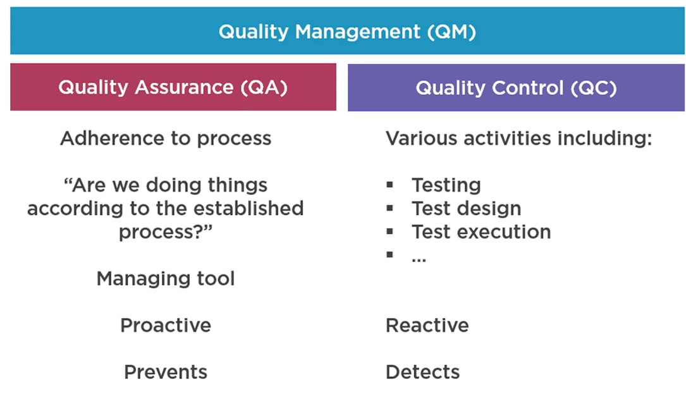
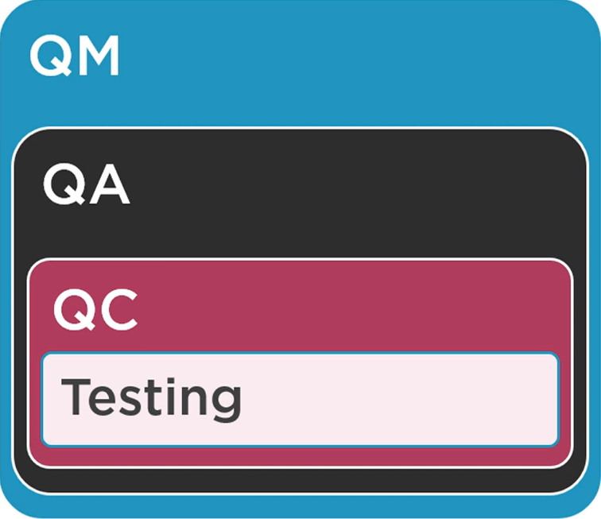
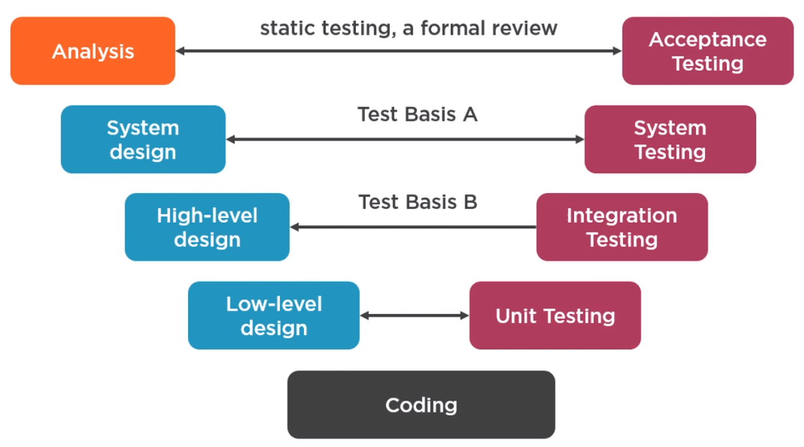
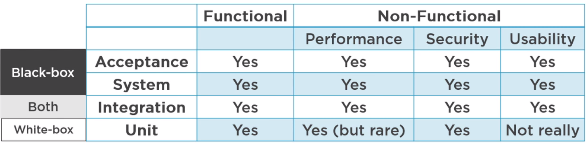

# **Tools**

Selenium, Web Driver.

# **Concepts**

## **What is testing?**
  
Process that include many different activities mainly execution of tests and results checking, also test planning, analysis, design test, bug reporting, test reporting.

### **Testing Objectives**

- Prevent defects by evaluating work products suck as requirements. (Prevent).
- Find defects and failures to increase the software quality. (Reacting).
- Verify all specified requirements are fulfilled
- Comply with contractual, legal, or regulatory requirements or standards.

## **Testing and debugging**

Testing is not debugging

| Testing | Debugging |
|---|---|
| Fund bugs | Finds and fixes root cause of bugs |
 

## Testing Contribution to Software

Testing and its contribution to software success, happens when we apply appropriate test techniques with the appropriate level of test expertise, and at the appropriate point in the SDLC.

Tester can and should be involved with:

- Review of requirements.
- The design. Helps with early defects detection and preparation for testing.
- Work closely with devs
- Verify and validate software before release.

## **QA vs Testing**

QM (Quality Management): everything testers do.
QA (Quality Assurance): Adherence to proper processes. Proactive, prevents.
QC (Quality Control): Reactive. Includes testing and its various activities. Focuses on product.

Consider QC part of QA

## **Errors, Defects and Failures**

- **Error**: Mistake. Something humans do.
- **Defect** (bugs), is a human mistake that gets built into the software
- **Failure**, bug that manifests while using the software.

It's better to deal with the root cause than its effects. But do not turn root cause analysis into a blame game

## **Testing Principles**

1. **Testing shows the presence of defects, not their absence**

2. **Exhaustive testing is impossible.**
  - *Combinatorial explosion*. Not having enough time to try all possible combinations.

3. **Early testing saves time and money.** It's better to find a defect on paper before it has bee converted to code by developers.

4. **Defects cluster together.** Analyses have found that bugs are typically grouped together in some of the modules that comprise the system. This help with prioritizing. Ex.: If a system has a feature that is going to be implemented in one of the modules and you have little time to test an approach if to:
  - Start with the updated module.
  - Follow with, in your experience with the system, that module that has bugs more frequently.
  - Continue with the rest of the modules if you have time left.

5. **Beware of the pesticide paradox.** With time, the same tests stop catching bugs. Avoid this by updating and creating new tests.
Also in you test instructions avoid the use of magic numbers:  
  Ex.: If you want to test an input with a large value like 10 billion, don't say 10 billion, say "any large number over ten billion"

6. **Testing is context dependent**. Learning test techniques and the system we are working on is important, but also keeping in mind the broader picture (context) will help you make better choices when testing. Your priorities, testing approach and entire workflow will be affected by your surroundings. 

7. **Absence-of-errors is a fallacy.** Although this principle is similar to the first one, the first principle means that you will never prove that there are no bugs. This principle means even if you catch and fox many important defects, your not guaranteed success.

## **Test Process Fundamentals**

### **Context influence on testing**

Influences of your testing decisions:

- External:
  - External Stakeholder interests
  - Domain
  - Laws and Standards
- Internal Factors:
  - SDLC, software development lifecycle (agile, waterfall, etc.)
  - Budget, resources, time
  - System complexity

### **Test Activities**:

- ***Planing***, Defining objectives of testing. What?, How to achieve them.
  - Monitoring and Control, On-going comparison of planned vs actual progress. Are we doing what we planned to do? Are we on track? Should we communicate our findings already?  
- ***Analyzing, analyze anything***: business requirements, functions/non-functional requirements, diagrams, design graph, code , metadata, risk analysis report. All material for Test Basis. Identify: ambiguities, omissions, inconsistencies, inaccuracies, contradictions and superfluous statements.
- ***Design***, [watch TestDesign.mp4 video in QA Automation Folder]
- ***Implementation/Testing***, if you have unexpected results:
  - Is the setup of the test correct?
  - Steps followed faithfully?
  - Test scenario has no fault
  - Still wrong? write a bug report!: log all test outcomes
- ***Completion***.
  - Ensuring all defect reports are closed.
  - Creating a test summary report
  - Finalizing, archiving and (or) sharing testware (test cases, test date, etc.)
  -  Analyzing lessons learned.

Not Necessarily in that order.

### Test Work Products ?

### Bug report content

Bug reports minimum content. What? When? How?

- Software version tested
- Link to relevant requirements
- Short description
- Concrete steps take to reproduce the failure
- Excepted results
- Actual result
- Screenshots, log snippets, etc. Useful information

### **Tester vs Developer Mindset**

Tendencies:

- *Who builds*: seeks proof that it works fine
- *Who tests*: Always think there's still a bug to be found.

## **QA automation**

Using a separate software to automatically perform tests for you to a piece of software.

 

## **Class of testing**

### **GUI testing**

Mimics the users interaction with the software. API testing. Tests the programming interface

### **Unit testing**

The easiest since you are testing the smallest pieces of software of the application.

 

## **Types of testing**

### **Integration test**

Multiple components are tested at once, through the code rather than the user interface. Questions that could answer: Does the software connects to the proper web service?

### **Functional test**

Tests the output disregarding the  internal functionality of the components.

### **Smoke test**

Test the stability and functionality of the build and its main features, 

### **End-to-end test**

Comprehensive test which is key to make sure the whole system works as intended.

### **Performance test**

Stability and speed with big data loads.

### **Regression test**

Confirms that new added features are no bringing old bugs back.

# **Software Development Lifecycle**

A systematic plan that defines a process and the what? who? when? and how? to deliver software in an organized and efficient way. A model that describes the types of activity performed at each stage in software development project and how activities relate to one another logically and chronologically.

**Building block** 
- analysis, 
- design, 
- development, 
- testing, 
- deployment 
- and maintenance.

## **SDLC Models**

### **Sequential**

#### **Waterfall**

It's linear. The previous module needs to end before starting the next one.

##### **Cons**
-Slow in execution. Next stage dependent on the previous one.
-Any phase can potentially become a bottle neck
-Very late feedback.
-Additional pressure on tester.

#### **V_Model**

V-Model integrates the testing throughout the development process with early testing.

 

### **Iterative** 

You do the usual development activity in small pieces. It's cycles can be divided by: features but more often by time cycles (typically 2 weeks or 1 month).

#### **Common iterative models**

- **Rational Unified Process**. Iterations are long. Delivers grouped interrelated features.

- **Agile**. Spans:
  - **Scrum**: Short iterations, fewer features and roles are assign
  - **Kanban**: More relax versions of scrum. Roles are share by everyone. Timelines evolve as needed.

- Spiral. Create experimental increments. The most flexible model. Allows to integrate a little bit of each other model.

### **Which one is better?**
Models are a simplifications of reality. Therefore, iterative models are NOT always better than sequential.

# **Test Levels**

## **Component Level**

Component/unit/module testing. focuses on components that are separately testable.

This is according to ISTQB, but in real life is more than possible that component, unit and module are not used interchangeably.

Since there can be confusion as of what a unit is, double-check how *you and your team define* the term unit module. Devs usually call it a single piece of code or source file, whereas for testers it could be a single business-level functionality.

 

**Test basis**
| Developers | Testers |
|---|---|
|*Static testing*. Just reading and finding mistakes in code. | Formal requirements |
| Automatic unit tests | Component specs, if you are asked to not look at the code |
| Finds and fixes root cause of bugs | |

 

## **Integration Level**

Once units are separately tested now we form a connecting them and make sure it works. The amount of units and what you define as a unit doesn't matter.

### ** Integration Level Subtypes**

**Component integration**. What we already discussed. Performed in a single system.

**System Integration**. Interactions between systems. Like connections to an API.

 

## **System Level**

In system testing our starting point is typically outside the system (whatever public interface the system has) and we take into consideration the systems paths and flows.

- E2E (end-to-end) testing,
- F2B (front-to-back) testing,

## **Acceptance Level**

Similar to software testing, since it focuses in validating the delivered software is complete and functional. But in additional it also considers **who**: *is the software resolving the problem of whom is ordering it?*

- **UAT** *(User Acceptance Testing)*. Are users able to use the software for their needs?
- **OAT** *(Operational Acceptance TEsting)*.
Backup and restore
Installing, uninstalling, upgrading
Disaster recovery
Data load and migration
Performance and load testing

 

# **Test Types**

## Alpha and Beta testing
Both perform by independent testers or potential customers.

Alpha, happens at the developer's site.
Beta, at the site of the customer. The main point of Beta testing is to use the infrastructure, both hardware and software, of the end users.

## **Functional Testing**

Tests functionality. Unit, integration, system, UI. We usually say Acceptance testing is done on System and UI.

### **Functional Coverage** 

A percentage that represents the amount of tests we've executed against the application out of total amount of tests there are or that we came up with. It allows us to quantify part of our testing process.

### **Coverage gap** 

Opposite of functional coverage: what we have not tested.

## Non-Functional Testing

Non-functional testing answer the how: how well, how fast, how stable, how usable, how secure.

### Types

- **Usability**: Feedback from users through alpha and beta testing is useful for this type of test.
- **Performance**: When mastered along with functional testing you can call yourself senior. It's broad and divided in subcategories. Some of them: Stress, Load, Endurance testing, etc.
- **Security**: Huge domain: Penetration, Ethical hacking, white-hat hacking, etc.

## **Blackbox vs Whitebox Testing**

Box is an analogy for the application you are testing.

- **Black-box**. You don't concern yourself on how what you are testing does what it does. You base yourself on what the documentation or requirements say it needs to do. It mostly involves:
  - sending input and reading output, 
  - timing response if part of your responsibility, 
  - integration and acceptance testing can be done as black-box.

- **White-box**. Knowing what is inside and using the knowledge. Mostly done by developers with unit testing. It is based on requirements but it may include technical specification to make sure if works fine internally.

## **Change-related testing**

- **Confirmation testing**. Was the bug fixed?
- **Regression testing**. The fix broke something else? If yes we call it a *regression bug* (or simply regression, an unintended side effect cause by a change). So we test the rest of the system and confirm all is working ok.

All that generates a lot testing to do and repeat on the regular basis. You would have to prioritize important testing unless you count with automation testing.

### Change Types

Bug fix, new features, change to existing features, configuration and environmental changes.

## Test Types and Test Levels

 

When trying to figure out what type or level of testing you are performing first understand it could be a mix. Then call it x or y depending on what you are focusing on.

*Integration testing* sits in between black and white box: grey-box testing.

## **Maintenance Testing**

Systems need to be maintained because changes are inevitable.

- **Unplanned change**. A bug in production that need a hotfix.
- **Planned change**. Software enhancements, operational and environmental upgrades, retirement.

### Impact Analysis

Evaluates the changes made to identify consequences and potential side-effects: What has changes where in the system which parts are definitely affected? Which parts are likely to be affected?