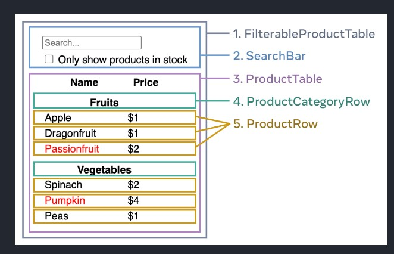

# Adding React to existing project

We add the following scripts before right before the `</body>` tag:

```html
<script
  src="https://unpkg.com/react@18/umd/react.development.js"
  crossorigin
></script>
<script
  src="https://unpkg.com/react-dom@18/umd/react-dom.development.js"
  crossorigin
></script>
<script src="component.js"></script>
```

The `component.js` file is the react component we will be creating. It could be something like:

```js
function MyButton() {
  return React.createElement(
    'button',
    {
      onClick: () => console.log('You clicked me!'),
    },
    'Like'
  );
}

const rootNode = document.getElementById('element');
const root = ReactDOM.createRoot(rootNode);
root.render(React.createElement(MyButton));
```

The last 3 lines:
1- Selects the html element where we will append our react component
2- Make that element our react root node
3- Render the react component in our root node

## Add JSX

You could add a babel script to the html file or install a JSX preprocessor for the project. Adding the babel script can significantly impact the performance of your website. To install de JSX preprocessor:

```
npm init -y
# Creates the package.json if you don't have it
npm install babel-cli@6 babel-preset-react-app@3
# These install the needed modules for the preprocessor
npx babel --watch src --out-dir . --presets react-app/prod
# runs a watcher on the folder src and any file saved there, that has jsx in it, is converted to regular js. The . indicates to safe the converted file in the projects root directory
```

# Editor setup

## Linting

Helps you find problems in your code as you write. For VS Code install its official extension [ESLint for VSCode](https://marketplace.visualstudio.com/items?itemName=dbaeumer.vscode-eslint).

You also need to have eslint installed in you project or globally (this is not recommended) for VS Code to enforce it. Projects created with Create React App come pre-configured with eslint.For projects that were not built with Create React App:

```
npm install --save-dev eslint-config-react-app eslint@^8.0.0
# This installs both eslint and the recommended package
```

The `eslint-config-react-app` contains the eslint configuration recommended for React and that Create React App comes with by default.

Then create a file named .eslintrc.json with following contents in the root folder of your project:

{
"extends": "react-app"
}

## Prettier

Formats your code to preset, configurable rules.

To install on VS Code:

- Press Ctrl+P
- Type `ext install esbenp.prettier-vscode`.

To format your files upon saving:

- Press Ctrl+Shift+P.
- Type `settings`.
- Open Settings(UI).
- Enable `format on save`

If ESLint preset has formatting rules that conflict with Prettier you can install the package: `eslint-config-prettier`. To configure your project to use the package [EsLint Config Prettier README](https://github.com/prettier/eslint-config-prettier#cli-helper-tool).

# Basics

## Components

Components are pieces of UI code that enclose their own logic and style. In JS these are commonly functions that return some markup.

## JSX

JSX is stricter than html. You have to close the tags `/>` and you can only return one single element. To return several you have to group them inside a parent element.

In JSX you can use curly brackets to escape into JS.

```js
return <p>{person.name}</p>;
```

## Styles

React doesn't have a particular way of adding styles to components. You should any method you prefer in your project.

## Displaying Lists

The only particular when displaying lists with react is that you need to make sure each element is uniquely identified with an ID so that react is aware to what happens with each individual item of the list.

```js
const products = [
  { item: 'Celery', id: 1 },
  { item: 'Juice', id: 2 },
  { item: 'Onion', id: 3 },
];

const listItems = products.map((product) => (
  <li key={product.id}>{product.item}</li>
));

return <ul>{listItems}</ul>;
```

## Event Handlers

You can pass event handlers directly to JSX as you would on regular HTML. However, when passing it do not call the function, react will do that for you.

```js
function handleClick(e) {
  console.log('you clicked me');
}

return <button onClick={handleClick}>Click me</button>;
```

## Hooks

Functions whose name starts with 'use'. They can only be called _at the beginning_ of the component. To use them somewhere else, like a if condition, wrap in a new component.

Hooks are stricter than regular functions. They can only be called at the top level of the component and can only be used in loops and conditions wrapped in a new component.

## Lifting state up

It means locating the common ancestor of all the components that need to share a certain state, declaring such state in the common ancestor and then passing the state as props to all children component that will make use of it.

```js
function App() {
  const [count, setCount] = useState(0);

  function handleClick() {
    setCount(count + 1);
  }

  return (
    <div>
      <MyButton onClick={handleClick} count={count} />
      <MyButton onClick={handleClick} count={count} />
    </div>
  );
}
```

# Thinking in React

## 1: Break down your UI into component hierarchy

You can use different approaches to decompose you UI:

- Programming: using the same techniques to decide if you should create a function or an object. Like the **Single responsibility principle**
- CSS: considering what you would make a class selector for.
- Design: how you would organize the design's layer.

If your data (could a JSON) is well structure it could naturally match the component structure.

Separate your components where each components matches one of your data model.



Finally arrange the components in a hierarchy. From the image above

- FilterableProductTable
  - SearchBar
  - ProductTable
    - ProductCategoryRow
    - ProductRow

## 2: Build a static version

It is commonly easier to create first a version in React with no interactivity. We are not to add any state yet. In this phase we create reusable components that accept props when necessary.

## 3: Find the minimal but complete representation of UI state

Find the minimal set of changing data that your app needs to remember. Verify the absolute minimal representation of the state your application needs and compute everything else on-demand. 

To know what qualifies as a state consider:

- Does it remain unchanged over time? If so, it isn’t state.
- Is it passed in from a parent via props? If so, it isn’t state.
- Can you compute it based on existing state or props in your component? If so, it definitely isn’t state!

In this [React Docs Example](https://beta.reactjs.org/learn/thinking-in-react) we have the following pieces of data:

1. The original list of products:  is passed in as props, so it’s not state.
2. The search text the user has entered: seems to be state since it changes over time and can’t be computed from anything.
3. The value of the checkbox: seems to be state since it changes over time and can’t be computed from anything.
4. The filtered list of products: isn’t state because it can be computed by taking the original list of products and filtering it.

## 4: Where your state should live

Identify what component owns the state, that is the one responsable for changing it. Following these steps should make it easier:

1. Identify every component that renders something based on that state.
2. Find a common ancestor of those components.
3. Decide where the state should live: into a common parent, into a component above the common parent or if they don't make sense in a new component above a common parent that will only be use to hold the state.