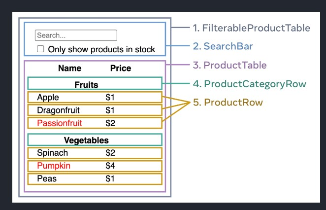

# Adding React to existing project

We add the following scripts before right before the `</body>` tag:

```html
<script
  src="https://unpkg.com/react@18/umd/react.development.js"
  crossorigin
></script>
<script
  src="https://unpkg.com/react-dom@18/umd/react-dom.development.js"
  crossorigin
></script>
<script src="component.js"></script>
```

The `component.js` file is the react component we will be creating. It could be something like:

```js
function MyButton() {
  return React.createElement(
    'button',
    {
      onClick: () => console.log('You clicked me!'),
    },
    'Like'
  );
}

const rootNode = document.getElementById('element');
const root = ReactDOM.createRoot(rootNode);
root.render(React.createElement(MyButton));
```

The last 3 lines:
1- Selects the html element where we will append our react component
2- Make that element our react root node
3- Render the react component in our root node

<br/>

## **Add JSX**

You could add a babel script to the html file or install a JSX preprocessor for the project. Adding the babel script can significantly impact the performance of your website. To install de JSX preprocessor:

```
npm init -y
# Creates the package.json if you don't have it
npm install babel-cli@6 babel-preset-react-app@3
# These install the needed modules for the preprocessor
npx babel --watch src --out-dir . --presets react-app/prod
# runs a watcher on the folder src and any file saved there, that has jsx in it, is converted to regular js. The . indicates to safe the converted file in the projects root directory
```

<br/>
<br/>

# Editor setup

<br/>

## **Linting**

Helps you find problems in your code as you write. For VS Code install its official extension [ESLint for VSCode](https://marketplace.visualstudio.com/items?itemName=dbaeumer.vscode-eslint).

You also need to have eslint installed in you project or globally (this is not recommended) for VS Code to enforce it. Projects created with Create React App come pre-configured with eslint.For projects that were not built with Create React App:

```
npm install --save-dev eslint-config-react-app eslint@^8.0.0
# This installs both eslint and the recommended package
```

The `eslint-config-react-app` contains the eslint configuration recommended for React and that Create React App comes with by default.

Then create a file named .eslintrc.json with following contents in the root folder of your project:

{
"extends": "react-app"
}

<br/>

## **Prettier**

Formats your code to preset, configurable rules.

To install on VS Code:

- Press Ctrl+P
- Type `ext install esbenp.prettier-vscode`.

To format your files upon saving:

- Press Ctrl+Shift+P.
- Type `settings`.
- Open Settings(UI).
- Enable `format on save`

If ESLint preset has formatting rules that conflict with Prettier you can install the package: `eslint-config-prettier`. To configure your project to use the package [EsLint Config Prettier README](https://github.com/prettier/eslint-config-prettier#cli-helper-tool).

<br/>
<br/>

# Basics

<br/>

## **Components**

Components are pieces of UI code that enclose their own logic and style. In JS these are commonly functions that return some markup.

<br/>

## **JSX**

JSX is stricter than html. You have to close the tags `/>` and you can only return one single element. To return several you have to group them inside a parent element.

In JSX you can use curly brackets to escape into JS.

```js
return <p>{person.name}</p>;
```

<br/>

## **Styles**

React doesn't have a particular way of adding styles to components. You should any method you prefer in your project.

<br/>

## **Displaying Lists**

The only particular when displaying lists with react is that you need to make sure each element is uniquely identified with an ID so that react is aware to what happens with each individual item of the list.

```js
const products = [
  { item: 'Celery', id: 1 },
  { item: 'Juice', id: 2 },
  { item: 'Onion', id: 3 },
];

const listItems = products.map((product) => (
  <li key={product.id}>{product.item}</li>
));

return <ul>{listItems}</ul>;
```

<br/>

## **Event Handlers**

You can pass event handlers directly to JSX as you would on regular HTML. However, when passing it do not call the function, react will do that for you.

```js
function handleClick(e) {
  console.log('you clicked me');
}

return <button onClick={handleClick}>Click me</button>;
```

<br/>

## **Hooks**

Functions whose name starts with 'use'. They can only be called _at the beginning_ of the component. To use them somewhere else, like a if condition, wrap in a new component.

Hooks are stricter than regular functions. They can only be called at the top level of the component and can only be used in loops and conditions wrapped in a new component.

<br/>

## **Lifting state up**

It means locating the common ancestor of all the components that need to share a certain state, declaring such state in the common ancestor and then passing the state as props to all children component that will make use of it.

```js
function App() {
  const [count, setCount] = useState(0);

  function handleClick() {
    setCount(count + 1);
  }

  return (
    <div>
      <MyButton onClick={handleClick} count={count} />
      <MyButton onClick={handleClick} count={count} />
    </div>
  );
}
```

<br/>
<br/>

# Thinking in React

<br/>

## **1: Break down your UI into component hierarchy**

You can use different approaches to decompose you UI:

- Programming: using the same techniques to decide if you should create a function or an object. Like the **Single responsibility principle**
- CSS: considering what you would make a class selector for.
- Design: how you would organize the design's layer.

If your data (could a JSON) is well structure it could naturally match the component structure.

Separate your components where each components matches one of your data model.



Finally arrange the components in a hierarchy. From the image above

- FilterableProductTable
  - SearchBar
  - ProductTable
    - ProductCategoryRow
    - ProductRow

<br/>

## **2: Build a static version**

It is commonly easier to create first a version in React with no interactivity. We are not to add any state yet. In this phase we create reusable components that accept props when necessary.

<br/>

## **3: Find the minimal but complete representation of UI state**

Find the minimal set of changing data that your app needs to remember. Verify the absolute minimal representation of the state your application needs and compute everything else on-demand. 

To know what qualifies as a state consider:

- Does it remain unchanged over time? If so, it isn’t state.
- Is it passed in from a parent via props? If so, it isn’t state.
- Can you compute it based on existing state or props in your component? If so, it definitely isn’t state!

In this [React Docs Example](https://beta.reactjs.org/learn/thinking-in-react) we have the following pieces of data:

1. The original list of products:  is passed in as props, so it’s not state.
2. The search text the user has entered: seems to be state since it changes over time and can’t be computed from anything.
3. The value of the checkbox: seems to be state since it changes over time and can’t be computed from anything.
4. The filtered list of products: isn’t state because it can be computed by taking the original list of products and filtering it.

<br/>

## **4: Where your state should live**

Identify what component owns the state, that is the one responsable for changing it. Following these steps should make it easier:

1. Identify every component that renders something based on that state.
2. Find a common ancestor of those components.
3. Decide where the state should live: into a common parent, into a component above the common parent or if they don't make sense in a new component above a common parent that will only be use to hold the state.

<br/>

## **5: Add inverse data flow**

In this stage you need to make sure that each component that is receiving states from a parent as a prop is capable of updating such states when needed.

On the example provided by the link in section 3 you achieve this by:

1. Since only the `SearchBar` component is going to need to update the states we pass it setFilterText and setInStockOnly as props.
2. Inside the return JSX of SearchBar assign the setters functions to the respective onChange attribute of the JSX elements that need them, updating the states by passing the values the user is modifying to the setters.

```js
function SearchBar({
  filterText,
  inStockOnly,
  onFilterTextChange,
  onInStockOnlyChange,
}) {
  return (
    <form>
      <input
        type="text"
        value={filterText}
        placeholder="Search..."
        onChange={(e) => onFilterTextChange(e.target.value)}
      />
      <label>
        <input
          type="checkbox"
          checked={inStockOnly}
          onChange={(e) => onInStockOnlyChange(e.target.checked)}
        />
        Only show products in stock
      </label>
    </form>
  );
}
```

<br/>
<br/>

# Describing the UI

<br/>

## **Components**

**Important**: You can render components inside components however do not nest their definitions. The result is sluggish and could easily get buggy.

<br/>

## **Importing and Exporting Components**

> When importing in React the following two statements do the same: 

```js
import Gallery from './Gallery';
import Gallery from './Gallery.js';
```

The only difference is that the import with `...'*.js'` is closer to native ES Modules.

<br/>

## **Writing Markup With JSX**

As JS control over websites increased by adding interactivity to it the need of a more JS focussed approach became more evident. This is why in react both the logic (JS) and the markup (JSX) share the same living space (components).

An easy way to convert HTML to JSX is to use a [Converter](https://transform.tools/html-to-jsx).

<br/>

### **Rules**

1. _Return a single element_. JSX is converted to a JS object when transpiled. Since you cannot return 2 objects in a JS function, then you need to use a wrapper when returning multiple JSX elements.
2. _Close all tags_.
3. _camelCase for most things_. Again JSX turns unto a JS object. Attributes in JSX turn to object Keys in JS and there are limits to naming in JS. For instance dashes are not accepted and there are reserved words, which is why we have className instead of class, strokeWidth instead of stroke-width, etc.

```js
    ↓1        ↓3
  <div className='sample'>
    <h1>Hola<h1>
    <p>Nested elements</p>
     ←2
  </di>
    ↑1
```

<br/>

## **JSX and curly braces**

There two places where you can use curly braces to tap into JS inside JSX:

1. Inside the body to JSX tags.
2. To specify the value of JSX elements' attributes, so after the `=` sign.

```js
<p className='personal-card'>{person.name}'s shopping list</p>

```

<br/>

### **{{`//what is this?`}}**

The ***double curlies*** are not an special syntax, it just mean you are inserting an anonymous object or inline CSS.

<br/>

## **Passing Props**

React components accept only one single argument: a _props_ object. However usually don't need to use all the components props, therefor destructuring is usually used to separate those props that concern us.

```js
function Profile({ person, size, isSepia, thickBorder }) {
  return (
    {/*JSX*/}
  );
}
```

**NOte**: In each rendering you get a new a version of props.

<br/>

### **Props default value**

```js
function Avatar({ person, size = 100 }) {
  // ...
}
```
The default value of a prop is used when the prop is missing or if its value is `undefined`. With `null` or `0` the default value won't be used.

<br/>

### **Props Shortcut**

If you have an object that holds all the props you want to pass to your component, instead of naming each prop you'll pass you can simply pass the whole object while *spreading it*

```js
const object = {prop1: 'text', prop2: 'text', prop3: 'text'};

return <MyComponent {...object}>;
```

<br/>

### **Passing JSX as children**

You can pass other components or directly JSX to a component which will pass on to it as a children prop.

```js
/*Apps.js file*/
<Card>
  <Avatar />
</Card>

/* Card.js file */
function Card({ children }) {
  return (
    <div className="card">
      {children}
    </div>
  );
}
```
Card will render the Avatar component.

<br/>

## **Conditional Rendering**

There are several ways you can conditionally display elements (JSX) in react.

- You could use simple if...else statements.
- Use ternary operator `(condition) ? true : false`.

```js
function RenderEitherOr({ isTrue }) {
  if (isTrue) {
    return <h1>It's true</h1>
  } 
  return <h1>It's false</h1>
}

function RenderEitherOr2({ isTrue }) {
  return (isTrue) ? <h1>It's true</h1> : <h1>It's false</h1>;
}

// Both components will work the same way
```
 
<br/>

### **Conditionally returning nothing**

We could simple return `null` we want to render nothing after certain condition is met. However, in practice that is rarely done. It is more practical to use the AND (&&) operator to short-circuit our code.

```js
function NothingIfFalse({ isTrue }) {
  const message = <h1>If you see me it was true</h1>;

  return isTrue && message;
}
```

It is important not to use numbers as values to evaluate with AND. For instance, we could expect that by evaluating the number 0 (which JS coerces to falsy) && will not render whatever it is operating on, however react would rather display the 0 than nothing.

```js
<NothingIfFalse isTrue={0} />
// Calling out previous component like this will render 0
```

<br/>

## **Render Lists**

You can simply use map() and filter() to render list of items. Storing the data to be listed in an array or an object allows to manipulate it easily when rendering.

```js
const rawData = [{id: 1, data: 'boo'},{id: 2, data: 'daz'}, {id: 3, data: 'hoo'}];

const listNumbers = rawData.map(item => <li key={item.id}>{item.data}</li>);

return <ul>{listNumbers}</ul>;
```

The `key` property doesn't get passed to `li` as prop, it's only used by React to ID that specific element in the list. **Elements inside map call always need a key.**

<br/>

### **Consideration on key placement**

When you have a component that represents each item of your list remember to pass the `key` to the component and not to the JSX returned by the component.

```js
function MyComponent({ id }) {
  return (
    <div key={id}>
      {...}
    </div>
  );
}

function ListItems() {
  // `recordsList` is the object that holds the data
  return (
    <>
      {recordsList.map(record => 
        <MyComponent {...record} />
      )}
    </>
  );
}
```

React will still ask for a unique key on each element of the list. This is because the `key` is needed immediately after the context of the iterable being mapped. To fix this you can do:

```js
function ListItems() {
  return (
    <>
      {recordsList.map(record => 
        <MyComponent {...record} key={record.id} />
      )}
    </>
  );
}
```

<br/>

### **Rendering several elements**

If each item of your list is formed by a group of elements wrapping them in a fragment (`<></>`) is not an option because you can't pass it properties. Although you could use a `div` a `<Fragment>` is more explicit.

```js
const listNumbers = rawData.map(item => {
  return (
    <Fragment key={item.id}>
      <h1>This is an item</h1>
      <p>{item.data}</p>
    </Fragment>
  );
});
```

As with `<>`, `<Fragment>` will not show in the DOM.

<br/>

## **Keep components pure**

A pure component is a pure function. In the context of components they:

1. Do not change data (props, variables) external to itself.
2. Given the same input you get the same JSX.

Since we usually work a lot with iterables, it is useful to keep in mind which operations mutate arrays

| Mutate | Not Mutate |
|--------|------------|
|push    |slice       |
|pop     |filter      |
|reverse |map         |
|sort    |            |

<br/>

### **Local mutation**

Your function is kept pure if you modified a locally declared variable. These are said to be *created during the same render of your component*.

<br/>

### **Rendering Order**

You should never expect components to render in any particular order. Components should only mind themselves and not try to coordinate with others component for rendering. Each component should handle its own JSX.

<br/>

### **Check pureness with Strict Mode**

React offers a strict mode in which components are rendered twice while in development. This feature can help us identify buggy non-pure components by the results of the double rendering.

To use it wrap your root component with `<React.StrictMode>`

```js
<React.StrictMode>
    <App />
</React.StrictMode>
```

Strict mode doesn't affect production.

<br/>

### **When side effects are needed**

You would usually use **event handlers** for side effects. Event handlers are ran when their associated actions are performed not upon rendering of the component anyway. Try to make this your *last resort*.

<br/>
<br/>

# Adding Interactivity

<br/>

## **Responding to Events**

Create and event handler function and pass it as a prop to JSX.

```js
function handleClick() {
  console.log('You clicked!!');
}

return (
  <button onClick={handleClick}>
    click me
  </button>
);
```

Consider that:

- By convention event handlers are named `handle` followed by the event name.
- The event handler should be passed not called in the prop. Otherwise, the callback handler will be called every time the component is rendered rather than later. Alternatively, if you need to add inline code to the JSX to avoid executing the code upon renders, wrap it with an anonymous function (arrow function).
```js
<button onClick={handleClick()}>
// or
<button onClick={() => alert('some message')}>

```

<br/>

### **Event propagation**

As with normal events in React events also bubble up. Starting from the element the event was originated from to its oldest ancestor. This means that if any of its ancestors has an event handler for the event in question, that handler will be executed as well. So we use the event handler object of the original element to stop propagation.

```js
<button onClick={e => {
  e.stopPropagation();
  alert('some message');
}}>
```

<br/>

### **Capture phase events**

In the event you need to at some point capture an event on child elements even if they are stopping propagation, you can do so by adding `Capture` to the event name.

```js
<div onClickCapture={() => { /* this runs first */ }}>
  <button onClick={e => e.stopPropagation()} />
  <button onClick={e => e.stopPropagation()} />
</div>
```

The propagation of events occur in 3 steps:

1. Depth execution of 'capture' event handlers.
2. Execution of the handler where the event originated.
3. Execution upwards of all other handlers of the event.

<br/>

### **Stopping default behavior**

We use `e.preventDefault()` for this. We do this because some browsers have default behaviors associated with certain events. For example, form submissions reload the current page by default.

```js
<button onClick={e => {
  e.preventDefault();
  alert('some message');
}}>
```

<br/>

## **State (`useState`)**

Simply put a *state* is data that changes over time. To make an stateful component we use the `useState` hook.

```js
import { useState } from 'react';

function MockComponent() {
  const [thisIsAState, setThisIsAState] = useState(0);

  return <p>{thisIsAState}</p>;
}
```

**Note**: Hooks, similar to input statements, must be called at the top of the components. They cant be called in conditions, loops, or other nested functions.

<br/>

### **Multiple states**

It is often a good idea to keep states separated. However, if you find yourself updating a group of states every time at the same time, then it could be useful to group and update them together by placing them in an object. For instance, the fields of a form.

<br/>

### **State is isolated and private**

If you were to render the same component multiple times their respective states will be independent. Making changes on one won't affect the other. Each state is stored separately. You can see it as being "local" to an specific place on the screen, not to a particular function call or code.

<br />

### **Rendering**

React follows these 3 steps to render elements:

1. **Trigger a render**. At the initial render of the component and when the component or one his ancestors' state changes.
2. **Rendering component**. Rendering is done recursively until all parents components (first) and their children (last) are rendered.
   - React calls the `root` component on initial render.
   - For future renders the function that belongs to the component that trigger the change.
   - This is also the phase where reacts confirms which properties have changed since the previous render.
3. **Commit changes to DOM**.
   - Upon first render DOM API `appendChild()` is used to add all needed nodes to the DOM.
   - On re-renders, only the minimal necessary operations are made to update the DOM. Only the changes between renders are applied.

The browser is responsable for the last step (browser rendering or painting) where the browser repaints the elements on the screen.

<br/>

### **State as a Snapshot**

Changes in the state do not change the state variable you already have. It triggers a re-render.

We can consider each re-render and its respective states, props, local variables, and event handlers a snapshot.

If you click a button that calls an update in a state:

1. The click event handler is executed.
2. The state is updated, which will cause a re-render.
3. The component is re-render with the new state value (a snapshot of the state value).

```js
function MyComponent() {
  const [myState, setMyState] = setState('');
  return (
    <button onClick={() => setMyState('I was clicked!')}>Click me!</button>
  );
}
```

Re-renders happen as follows:

1. React calls your component function again.
2. The function returns its updated JSX.
3. The screen updates with the returned JSX.

Whenever you read the value of a state, you get the value in that particular render. Any update called upon by setState() reflects in the next render. This is why the following returns 1 and not 3:

```js
const [number, setNumber] = setState(0);

return (
  <button onClick={() => {
    setNumber(number + 1);
    setNumber(number + 1);
    setNumber(number + 1);
  }}>+3</button>
);
```

For the current render the value of `number` is always 0. It will only change in the next render. It is similar to saying:

```js
setNumber(0 + 1);
setNumber(0 + 1);
setNumber(0 + 1);
```

<br />

### **Rendering Asynchronously**

What if you use the value of the state long after the re-rendering is over?

```js
const [number, setNumber] = setState(1);

return (
  <h2>{number}</h2>
  <button onClick={() => {
    setNumber(number + 2);
    setTimeout(() => console.log(number), 1000);
  }}>Click</button>
);

// h2 will display 3 but console.log
```

React preserves the current render snapshot values in the event handlers (values are fixed within render's event handlers). `setTimeout` is called with the state value of the current render not the next one.

